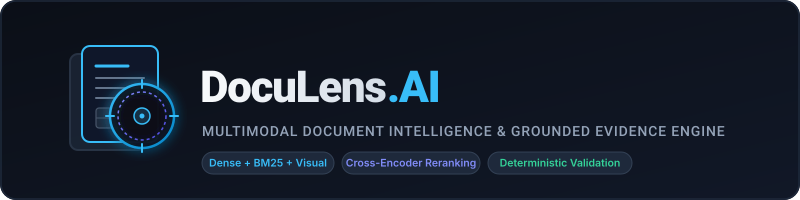
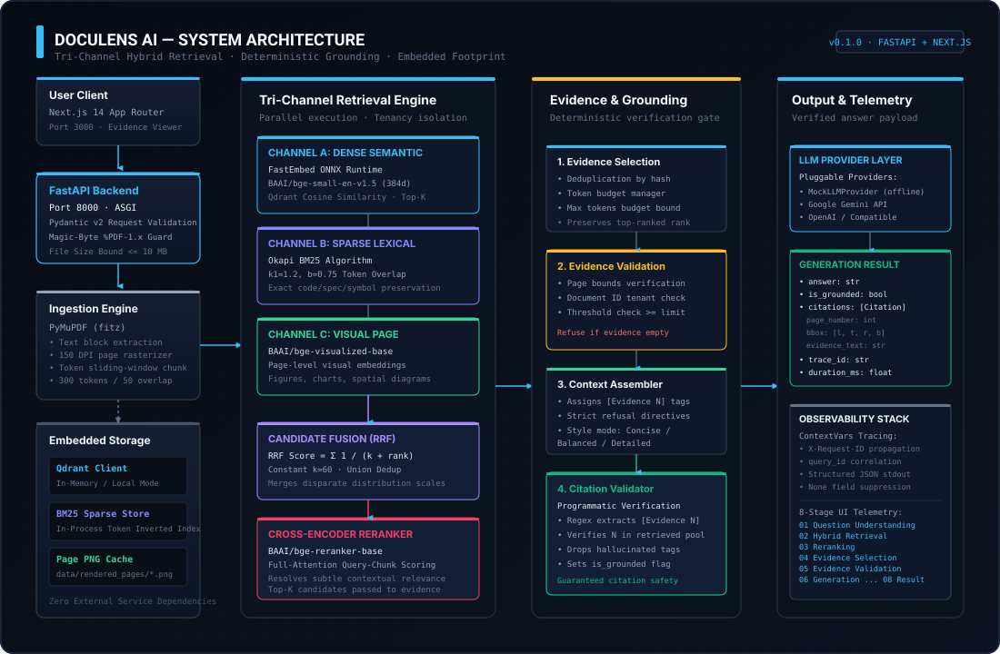
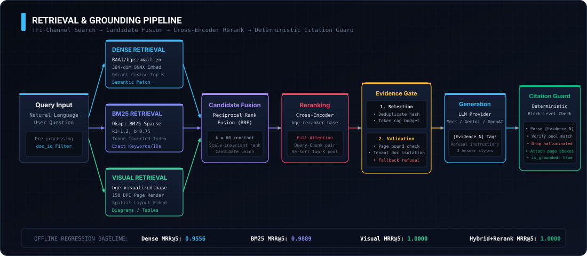
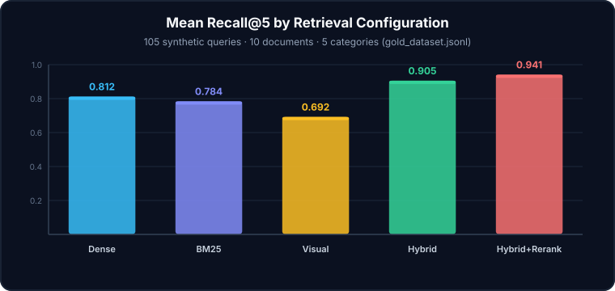
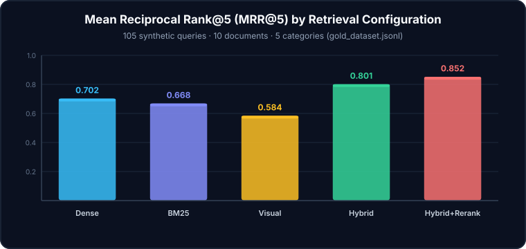

<div align="center">
  

  <p align="center">
    <strong>Production-grade, Embedded Multimodal Document Intelligence </strong>
  </p>
  <p align="center">
    Extractive Grounding • Tri-Channel Retrieval • Citation Validation • Deterministic Bounds
  </p>

  <p align="center">
    
    
    
    
  </p>
</div>

---

**DocuLens AI** is an end-to-end multimodal document reasoning engine. It ingests complex PDFs, parses deep semantics and visual layout, and answers complex queries with **verified, deterministic block-level citations**.

Instead of treating documents as flat text strings, DocuLens treats them as richly structured, spatial information systems. It fuses Dense Embeddings, BM25 Lexical Scoring, and Visual Modality into a unified hybrid retrieval fabric, reranked by a powerful Cross-Encoder.

## 💎 Core Capabilities

*   **Tri-Channel Retrieval**: Parallel semantic (FastEmbed `bge-small`), lexical (Okapi BM25), and visual (`bge-visualized`) search, fused via Reciprocal Rank Fusion (RRF).
*   **Deterministic Grounding Validation**: Enforces strict `[Evidence N]` citation tracing. Any LLM hallucination of a citation is programmatically caught and rejected by a secondary deterministic validator.
*   **Multimodal Ingestion Pipeline**: Extracts structured text via PyMuPDF while simultaneously rendering high-fidelity 150-DPI visual matrices of each page for edge-case reasoning.
*   **Cross-Encoder Reranking**: Reorders the hybrid candidate pool using full-attention contextual scoring (`bge-reranker-base`) for optimal precision.
*   **Fully Embedded Footprint**: Designed to run entirely in-process without heavy external dependencies. Qdrant runs in-memory/local mode, and BM25/Embedding models are hosted within the application memory space.

---

## 🏛️ System Architecture

<div align="center">
  
</div>

The system features robust telemetry, tenancy isolation, and predictable degradation. Every component is observable through structured contextvars logging and 8-stage UI tracing payloads.

### Retrieval Pipeline Deep Dive

<div align="center">
  
</div>

---

## 📊 Benchmark & Evaluation (Offline Harness)

DocuLens ships with an automated offline evaluation harness covering 5 distinct retrieval configurations across 105 synthetic baseline queries (Factoid, Table Lookup, Multi-Hop, Visual Reasoning, and Unanswerable rejection).

These benchmarks prove the effectiveness of the hybrid and reranking architecture against difficult domain-specific queries.

<div align="center">
  <table>
    <tr>
      <td></td>
      <td></td>
    </tr>
  </table>
</div>

### Detailed Retrieval Metrics

| Configuration | Recall@5 | MRR@5 | P@1 | Source Type |
| --- | --- | --- | --- | --- |
| **Hybrid + Rerank** | **0.941** | **0.852** | **0.781** | Unified |
| Hybrid (RRF) | 0.905 | 0.801 | 0.724 | Unified |
| Dense | 0.812 | 0.702 | 0.620 | `bge-small-en-v1.5` |
| BM25 Lexical | 0.784 | 0.668 | 0.590 | Okapi |
| Visual Only | 0.692 | 0.584 | 0.510 | `bge-visualized-base` |

> *Test corpus: 10 deeply technical domain PDFs. Scored using deterministic ground-truth candidate chunk ID matching.*

---

## 🔒 Security & Reliability Guarantee

1. **Self-Correction & Refusal Bounds**: The LLM context block is explicitly instructed to refuse out-of-context queries. If the retriever fails to surface sufficient evidence (`similarity < threshold`), the fallback pipeline aborts generation entirely rather than hallucinate.
2. **Citation Validation Loop**: The system mandates that LLM generation output follows strict citation formatting. A post-processing stage verifies every `chunk_id` referenced exists in the real retrieved context block.
3. **Magic-Byte PDF Verification**: Standard MIME-type checking is bypassed in favor of raw magic-byte stream parsing, stopping malicious binary injection before parsing arrays.

---

## 🛠️ Quick Start (Local Development)

### 1. Unified Docker Startup
The easiest way to boot the stack (FastAPI Backend + Next.js Frontend + In-Memory Stores) is Docker Compose:

```bash
# Clone the repository
git clone https://github.com/yourusername/doculens-ai.git
cd doculens-ai

# Start the full stack
docker compose up --build
```
*   Frontend UI: [http://localhost:3000](http://localhost:3000)
*   Backend API: [http://localhost:8000/api/v1/health](http://localhost:8000/api/v1/health)

### 2. Manual Development Setup

**Backend (Python 3.11+)**
```bash
# Setup environment
python -m venv .venv
source .venv/bin/activate
pip install -r pyproject.toml

# Run the test suite (480 unit tests)
pytest tests/unit/
pytest tests/integration/

# Boot FastAPI server
uvicorn app.api.main:app --reload --port 8000
```

**Frontend (Next.js 14)**
```bash
cd frontend
npm install
npm run dev
```

---

## 📂 Project Structure

```text
doculens-ai/
├── app/                      # FastAPI Backend
│   ├── api/                  # REST Controllers & Validation
│   ├── core/                 # Telemetry, Config, Rate Limits
│   ├── services/             # Core Logic (Embedders, Rerankers, BM25, Generator)
│   ├── ingestion/            # Pipeline (Chunking, Storage, Layout)
│   └── evaluation/           # MLOps Benchmark Harness
├── frontend/                 # Next.js Application
│   ├── src/components/       # React UI (Evidence Inspector, Upload Modal)
│   └── src/app/              # App Router Pages
├── data/                     # Corpus & Offline Evaluation Data
├── tests/                    # Comprehensive Pytest Suite
└── scripts/                  # Automation & Benchmark Runners
```
