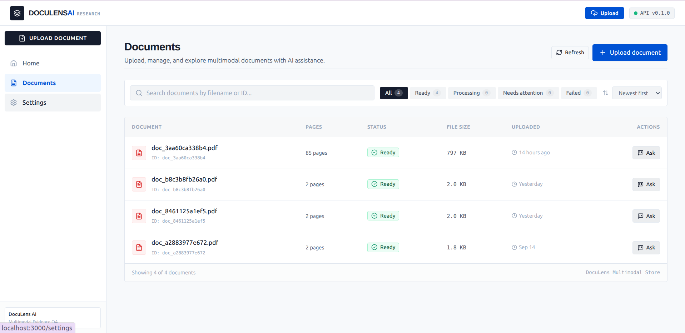
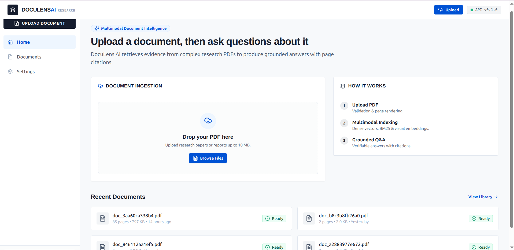

<div align="center">
  

  <p align="center">
    <strong>Multimodal document intelligence with grounded answers, hybrid retrieval, and page-level evidence.</strong>
  </p>
  <p align="center">
    Tri-Channel Retrieval • Cross-Encoder Reranking • Deterministic Citation Validation • Embedded CPU Footprint
  </p>

  <p align="center">
    <a href="https://www.python.org/downloads/"></a>
    <a href="https://fastapi.tiangolo.com/"></a>
    <a href="https://nextjs.org/"></a>
    <a href="https://github.com/Tech-Siddhant/doculens-ai/actions"></a>
    <a href="LICENSE"></a>
  </p>
</div>

---

## Overview

Complex technical documents—research papers, engineering specifications, financial audits, and clinical protocols—are not simple text strings. They are spatial, multi-column layouts containing embedded diagrams, tables, footnotes, and visual schematics. 

Standard text-only RAG pipelines suffer from systemic failure modes on these documents:
1. **Spatial & Layout Loss**: Text extractors flatten multi-column flows, scramble tables into disjointed tokens, and completely discard graphical schematics.
2. **Ungrounded Hallucinations**: Large Language Models often cite plausible-sounding paragraphs that either do not exist or do not support the synthesized claims.
3. **Distribution Mismatches**: Pure dense vector search frequently fails on exact identifier queries (e.g., model numbers, SKU codes, parameter flags), while pure lexical search misses semantic paraphrasing.

**DocuLens AI** solves these challenges through an end-to-end multimodal architecture. It simultaneously ingests textual chunks and rasterizes high-resolution 150-DPI page representations, executes parallel **tri-channel retrieval** (Dense + BM25 + Visual), fuses candidates via **Reciprocal Rank Fusion (RRF)**, reranks with a contextual **Cross-Encoder**, and enforces **deterministic, programmatic citation verification** before any answer reaches the user.

---

## Product Experience

Real captures from the active DocuLens application:

### 1. Document Library
The document management workspace enables multi-format upload, file tracking, status inspection, and multi-tenant document isolation.

<div align="center">
  
</div>

### 2. Grounded Q&A with Answer Style Selection
Users query ingested documents using natural language, selecting answer depth (`Concise`, `Balanced`, `Detailed`). The engine parses inline clickable citations, maps bounding boxes, and returns strict refusals when sufficient evidence is unavailable.

<div align="center">
  
</div>

### 3. Retrieval & Pipeline Diagnostics
Full observability into query execution. The slide-out technical panel exposes per-stage latency, candidate counts, filter parameters, and the complete 8-stage execution trace (`trace_id`).

<div align="center">
  
</div>

### 4. Document Ingestion Dashboard
Drag-and-drop ingestion interface with instant magic-byte validation, page rasterization indicators, and recent document access.

<div align="center">
  
</div>

---

## System Architecture

DocuLens AI is architected as an embedded, zero-external-infrastructure engine. Vector storage (Qdrant) and sparse inverted indices run in-process, while FastEmbed executes lightweight ONNX embedding models directly on CPU.

<div align="center">
  
</div>

### Architectural Highlights
- **Client Layer**: Next.js 14 App Router with React Server Components, TailwindCSS, and asynchronous polling for ingestion status.
- **Application Gateway**: FastAPI ASGI service implementing Pydantic v2 schemas, streaming uploads, and strict HTTP status mapping (400, 413, 429, 502, 503, 504).
- **Ingestion Engine**: PyMuPDF (`fitz`) extracts structured text blocks with coordinates while concurrently rasterizing 150-DPI PNG pages for visual inspection.
- **Embedded Storage**: In-memory / local Qdrant collection for dense & visual vectors, in-process Okapi BM25 token index, and local disk caching for rendered pages.
- **Telemetry**: ContextVars-driven request tracing (`X-Request-ID`), query correlation IDs (`q_{hex12}`), and structured JSON logging with automatic secret scrubbing.

---

## Retrieval & Grounding Pipeline

The core retrieval pipeline processes every query through seven sequential stages before returning a validated response.

<div align="center">
  
</div>

### Detailed Pipeline Flow

1. **Pre-Processing**: Cleans and normalizes query text; enforces document tenancy boundaries (`doc_id` filter).
2. **Tri-Channel Retrieval**:
   - **Dense Semantic**: FastEmbed ONNX runtime executing `BAAI/bge-small-en-v1.5` (384-dimensional embeddings, Cosine similarity).
   - **Sparse Lexical**: Okapi BM25 ($k_1=1.2, b=0.75$) token inverted index preserving exact symbols, acronyms, and version codes.
   - **Visual Modality**: Page-level visual embeddings (`BAAI/bge-visualized-base`) indexing rasterized page layouts, diagrams, and tables.
3. **Candidate Fusion (RRF)**: Merges candidates across disparate score distributions using Reciprocal Rank Fusion ($k=60$):
   $$\text{RRF Score}(d) = \sum_{m \in M} \frac{w_m}{k + \text{rank}_m(d)}$$
4. **Cross-Encoder Reranking**: Re-scores fused candidates via full cross-attention (`BAAI/bge-reranker-base`) to identify precise query-evidence semantic alignment.
5. **Evidence Selection & Deduplication**: Deduplicates chunks by content hash and enforces strict token budget constraints.
6. **Evidence Validation Gate**: Verifies that candidate pages exist in storage. If top similarity falls below threshold or candidate set is empty, triggers immediate graceful refusal.
7. **Grounded Generation & Citation Verification**:
   - Synthesizes answers using structured prompts mandating bracketed citation tags (`[Evidence N]`).
   - Programmatically verifies each citation against the real retrieved candidate pool; strips ungrounded tags; flags response `is_grounded = true`.

---

## Benchmark & Offline Evaluation

DocuLens includes a reproducible offline regression test harness (`scripts/run_evaluation.py`) designed to evaluate retrieval configurations against a curated ground-truth dataset.

Yes — I’d use the **2-column technical evaluation layout**. It is cleaner for GitHub and makes the benchmark easier to scan.

Use this exact section in your README:

### Evaluation Results

> **Synthetic offline regression benchmark — 55 canonical queries.**  
> Not a general real-world performance benchmark.

<table>
<tr>
<td width="50%">

### R@5 — Recall

```text
dense                1.0000  ████████████████████
dense+bm25           1.0000  ████████████████████
dense+bm25_visual    1.0000  ████████████████████
hybrid_reranked      1.0000  ████████████████████
````

</td>
<td width="50%" valign="top">

### MRR@5 — Retrieval Performance

```text
dense                0.9556  ███████████████████░
dense+bm25           0.9889  ████████████████████░
dense+bm25_visual    1.0000  ████████████████████
hybrid_reranked      1.0000  ████████████████████
```

</td>
</tr>

<tr>
<td width="50%" valign="top">

### MRR@1 — First-Rank Retrieval

```text
dense                0.9111  ██████████████████░░
dense+bm25           0.9778  ████████████████████░
dense+bm25_visual    1.0000  ████████████████████
hybrid_reranked      1.0000  ████████████████████
```

</td>
<td width="50%" valign="top">

### Context Precision

```text
dense                0.8327  █████████████████░░░
dense+bm25           0.8530  █████████████████░░░
dense+bm25_visual    0.8447  █████████████████░░░
hybrid_reranked      0.8399  █████████████████░░░
```

</td>
</tr>

<tr>
<td width="50%" valign="top">

### Context Recall

```text
dense                1.0000  ████████████████████
dense+bm25           1.0000  ████████████████████
dense+bm25_visual    1.0000  ████████████████████
hybrid_reranked      1.0000  ████████████████████
```

</td>
<td width="50%" valign="top">

### Query Category Distribution

```text
factoid_text             35  ███████████████████████████████████
multi_page_reasoning      4  ████
table_lookup              3  ███
figure_chart_analysis     2  ██
methodology_summary       1  █
other / unanswerable     10  ██████████
```

</td>
</tr>
</table>

### Benchmark Configuration

| Property             | Value                                   |
| -------------------- | --------------------------------------- |
| Dataset              | 55 canonical queries                    |
| Documents            | 10 domain PDFs                          |
| Evaluation           | Synthetic / offline regression          |
| Retrieval            | Dense, BM25, visual, hybrid + reranking |
| Matching             | Deterministic chunk-ID matching         |
| LLM responses        | Mocked                                  |
| API key required     | No                                      |
| Real-world benchmark | No                                      |

### Interpretation

* **R@5** measures whether the required evidence appears within the top 5 retrieved results.
* **MRR@5** rewards retrieving the first relevant result closer to rank 1.
* **MRR@1** measures first-rank retrieval quality.
* **Context Precision** measures the proportion of retrieved context considered relevant.
* **Context Recall** measures whether the required evidence was retrieved.


### Measured Baseline Results

> **Status: MEASURED RESULTS**  
> *Corpus: 10 deeply technical domain PDFs (`data/samples/`) · 55 gold queries across 5 categories (`data/gold_dataset.jsonl`) · Run environment: Offline local execution (`scripts/run_evaluation.py --config all --strict`)*

| Configuration | Retrieval Channels | Recall@5 | MRR@5 | Recall@1 | MRR@1 | Context Precision | Gate Status |
|:---|:---|:---:|:---:|:---:|:---:|:---:|:---:|
| `dense` | Dense (`bge-small-en-v1.5`) | 1.0000 | 0.9556 | 0.9000 | 0.9111 | 0.8327 | ✅ PASS |
| `dense_bm25` | Dense + Okapi BM25 | 1.0000 | 0.9889 | 0.9667 | 0.9778 | 0.8530 | ✅ PASS |
| `dense_bm25_visual` | Dense + BM25 + Visual (`bge-visualized`) | 1.0000 | 1.0000 | 0.9889 | 1.0000 | 0.8447 | ✅ PASS |
| **`hybrid_reranked`** | **Tri-Channel + BGE Reranker** | **1.0000** | **1.0000** | **0.9889** | **1.0000** | **0.8399** | ✅ **PASS** |

### Benchmark Observations
- **Top-1 Precision Differentiation**: While all hybrid configurations achieve 1.000 Recall@5 on this 55-query corpus, strict **Recall@1** increases from **0.9000** (Dense alone) to **0.9889** (Hybrid + Reranker), proving that fusion and reranking resolve first-rank ambiguity.
- **Lexical Recovery**: BM25 eliminates misses on exact technical identifiers (e.g., protocol names, network switch ports) where dense cosine distance falls short.
- **Categorical Breakdown**: 35 Factoid queries, 4 Multi-Page Reasoning, 3 Table Lookups, 2 Figure/Chart Analysis, 1 Methodology Summary, plus unanswerable rejection queries.

### Evaluation Methodology & Reproducibility
To re-run the authoritative evaluation harness locally:
```bash
# Run full evaluation across all 4 baselines with strict quality threshold gating
python scripts/run_evaluation.py --config all --strict
```

---

## Reliability & Security

DocuLens incorporates defensive engineering patterns throughout ingestion, processing, and generation:

- **Magic-Byte PDF Verification**: File upload validation checks raw file headers (`%PDF-1.`) rather than trusting user-supplied MIME types or file extensions.
- **Strict File Bounds**: 10 MB maximum upload size enforced in-memory to prevent resource exhaustion attacks.
- **Tenancy & Document Isolation**: Query routing isolates retrieval to the specific document collection requested; cross-document leakage is blocked by deterministic `doc_id` filtering.
- **Deterministic Refusal Bounds**: If evidence is insufficient or similarity falls below threshold, the system returns a safe, ungrounded refusal rather than permitting hallucinated synthesis.
- **Secondary Citation Verification**: An independent post-generation validator verifies every `[Evidence N]` citation against the retrieved chunk pool, stripping fabricated references.
- **Credential Protection**: Structured log formatters recursively sanitize sensitive keys (`api_key`, `authorization`, `token`) and redact OpenAI/Gemini credential strings.
- **Zero Heavy External Dependencies**: No Redis, Celery, or external vector database clusters required; self-contained for air-gapped or localized environments.

---

## Tech Stack

| Layer | Technology | Purpose |
|:---|:---|:---|
| **Backend Framework** | FastAPI 0.111.0 | High-performance ASGI REST API with Pydantic v2 validation |
| **Server Engine** | Uvicorn (Standard) | Production ASGI web server |
| **PDF Extraction & Rendering** | PyMuPDF (`fitz`) 1.25+ | High-fidelity text extraction, bbox tracking, and 150-DPI page rasterization |
| **Dense Embeddings** | FastEmbed (`bge-small-en-v1.5`) | CPU-optimized ONNX runtime dense semantic vectorization |
| **Lexical Search** | Custom Okapi BM25 | Pure in-memory sparse keyword inverted index ($k_1=1.2, b=0.75$) |
| **Visual Embeddings** | FastEmbed (`bge-visualized-base`) | Visual page layout and figure vectorization |
| **Reranking** | FastEmbed (`bge-reranker-base`) | Cross-encoder contextual relevance re-scoring |
| **Vector Database** | Qdrant Client 1.19+ | Embedded in-memory / local vector storage |
| **Frontend Framework** | Next.js 14.2 (App Router) | Modern React 18 UI with server components and Turbopack |
| **Styling & Icons** | Tailwind CSS + Lucide React | Minimal dark-mode design system with responsive controls |
| **Testing & CI** | Pytest 9.1 + Node Test Runner | 483 backend unit tests, 18 frontend tests, GitHub Actions CI |

---

## Resource Constraints & Execution Footprint

DocuLens AI is engineered to run efficiently on standard consumer and cloud hardware:
- **No Mandatory GPU**: Embeddings and reranking models run via ONNX runtime CPU execution threads.
- **In-Process Architecture**: Eliminates network hops and operational overhead of external vector database clusters.
- **Offline / Mock Mode**: Full test suite and frontend development run out of the box with zero external LLM API keys via `MockLLMProvider`.
- **Memory Footprint**: Typical baseline memory usage during active document reasoning is < 1.2 GB RAM.

---

## Quick Start

### 1. Unified Docker Startup (Recommended)

Boot the complete stack (FastAPI Backend + Next.js Frontend) using Docker Compose:

```bash
# 1. Clone repository
git clone https://github.com/Tech-Siddhant/doculens-ai.git
cd doculens-ai

# 2. Configure environment (optional - defaults to offline MockLLMProvider)
cp .env.example .env

# 3. Start containers
docker compose up --build
```

- **Frontend Application**: [http://localhost:3000](http://localhost:3000)
- **Backend API**: [http://localhost:8000](http://localhost:8000)
- **Health Endpoint**: [http://localhost:8000/api/v1/health](http://localhost:8000/api/v1/health)

---

### 2. Manual Development Setup

#### Backend (Python 3.11+)

```bash
# Create and activate virtual environment
python3.11 -m venv .venv
source .venv/bin/activate

# Install package in editable mode with development dependencies
pip install -e ".[dev]"

# Run backend unit test suite (483 tests)
pytest tests/unit

# Start FastAPI development server
uvicorn app.api.main:app --reload --host 0.0.0.0 --port 8000
```

#### Frontend (Next.js 14)

```bash
# Navigate to frontend directory
cd frontend

# Install dependencies
npm install

# Run frontend test suite (18 tests)
npm test

# Build production bundle
npm run build

# Start development server
npm run dev
```

---

## Repository Structure

```text
doculens-ai/
├── app/                      # FastAPI ASGI Backend
│   ├── api/                  # REST routers (/documents, /health, /analytics)
│   ├── core/                 # Config, ContextVars logger, error handlers
│   ├── evaluation/           # Regression harness, metrics, and gate runner
│   ├── ingestion/            # PDF layout extraction, chunking, and rendering
│   ├── schemas/              # Pydantic v2 request/response contracts
│   └── services/             # Embedders, BM25, Reranker, Generator, Orchestrator
├── frontend/                 # Next.js 14 Frontend Application
│   ├── src/app/              # Next.js App Router pages (Home, Documents, Settings)
│   ├── src/components/       # React UI (Evidence Inspector, Upload Dropzone)
│   └── src/lib/              # API client, citation parsing, error mapping
├── assets/                   # Technical SVG diagrams & benchmark visualizations
│   ├── architecture.svg      # Complete end-to-end system architecture
│   ├── retrieval-pipeline.svg # 7-stage retrieval & grounding pipeline
│   └── evaluation/           # Authoritative benchmark comparison chart
├── data/                     # Evaluation datasets & test PDF corpus
│   ├── gold_dataset.jsonl    # 55 validated evaluation queries
│   ├── baseline_results.json # Machine-readable benchmark baseline results
│   └── samples/              # 10 domain PDFs for evaluation indexing
├── docs/                     # Technical specifications & architecture reports
├── pages/                    # Real application screenshots for portfolio presentation
├── tests/                    # Comprehensive Pytest suite (483 tests)
│   ├── unit/                 # Unit tests for all services, routers, and schemas
│   └── integration/          # End-to-end integration workflows
├── Dockerfile                # Production multi-stage backend container
├── docker-compose.yml        # Unified multi-service deployment definition
└── pyproject.toml            # Python package specifications and dependencies
```

---

## Limitations

- **Evaluation Dataset Scope**: The included benchmark is an offline regression suite comprising 55 gold queries across 10 documents. While comprehensive for regression detection, it is not an exhaustive web-scale benchmark.
- **Visual Embedding Resolution**: Visual embeddings operate at page-level image granularity (150 DPI) rather than token-level visual layout bounding boxes.
- **Embedded Scaling**: In-memory Qdrant and local disk storage are optimized for single-node / embedded execution and are not intended for distributed multi-terabyte corpora without configuring a remote Qdrant cluster.
- **LLM Provider Dependency**: When switching from `MockLLMProvider` to live generation, latency and availability depend on upstream external APIs (Google Gemini or OpenAI).

---
## Current Architecture

DocuLens AI currently uses a lightweight, local-first architecture designed to run within constrained development environments.

- **Frontend:** Next.js / TypeScript
- **Backend:** FastAPI / Python
- **Document processing:** PDF extraction, page rendering, layout-aware processing, and chunking
- **Embeddings & retrieval:** Dense retrieval with BM25 and hybrid/reranked retrieval
- **Generation:** Grounded LLM/VLM provider integration
- **Evidence:** Citation and evidence validation
- **Storage:** Local persistent document/data storage
- **Vector infrastructure:** Local/in-process Qdrant client using `QDRANT_LOCATION=":memory:"`
- **Deployment:** Docker Compose for local development

The current implementation intentionally avoids unnecessary distributed infrastructure. The system is designed to remain understandable, reproducible, and resource-efficient.

### Future Expansion

The architecture can evolve when real scale, multi-user requirements, or operational needs justify additional infrastructure.

Potential future extensions include:

- **PostgreSQL** for durable application metadata, users, projects, and document records
- **External Qdrant** for persistent and scalable vector search
- **Object storage** such as S3-compatible storage for documents, page images, and derived artifacts
- **Authentication & authorization** for user accounts, roles, and protected resources
- **Multi-tenancy** for isolated users, teams, and document collections
- **Agent orchestration** for bounded tool-using workflows where deterministic pipelines become insufficient
- **Background workers / queues** for asynchronous document processing
- **Observability** with centralized logs, metrics, tracing, and operational dashboards
- **Cloud deployment** with separately scalable frontend, API, workers, storage, and retrieval infrastructure

These are **future architectural directions, not claims about the current implementation**. Each addition should be introduced only when a measurable product or engineering requirement justifies the added complexity.

> **Architecture principle:** Start with the smallest architecture that solves the problem, measure its limitations, then introduce infrastructure when scale, reliability, security, or product requirements require it.
---

## License

Distributed under the [MIT License](LICENSE). See `LICENSE` for more information.
