# DocuLens AI — System Architecture

> **Multimodal Document Intelligence with Grounded AI**

DocuLens AI is a multimodal document intelligence platform that processes complex documents, retrieves evidence from both textual and visual representations, and generates grounded answers with page-level citations.

The architecture is designed to evolve from a simple text-based retrieval baseline into a multimodal, agent-assisted, evaluated, observable, and deployable AI system.

---

# 1. High-Level Architecture

## 1.1 System Overview

DocuLens AI consists of five major architectural layers:

1. **Frontend** — user-facing document and question-answering interface.
2. **API/Application Layer** — authentication, document management, orchestration, and API contracts.
3. **Document Intelligence Layer** — PDF parsing, structure extraction, page rendering, chunking, and embedding generation.
4. **Retrieval and Generation Layer** — dense, sparse, visual retrieval, fusion, reranking, grounding, and LLM/VLM generation.
5. **Infrastructure Layer** — PostgreSQL, Qdrant, document storage, observability, and external AI providers.

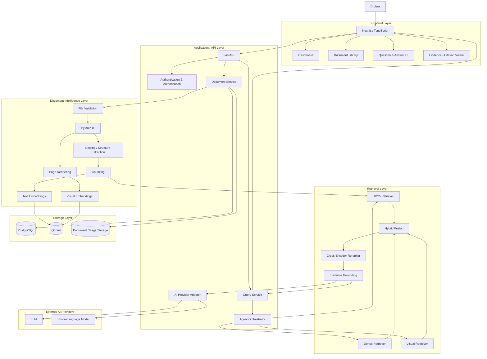
```mermaid
flowchart TB

    USER["👤 User"]

    subgraph FRONTEND["Frontend Layer"]
        UI["Next.js / TypeScript"]
        DASHBOARD["Dashboard"]
        DOC_UI["Document Library"]
        QUERY_UI["Question & Answer UI"]
        EVIDENCE_UI["Evidence / Citation Viewer"]
    end

    subgraph API["Application / API Layer"]
        FASTAPI["FastAPI"]
        AUTH["Authentication & Authorization"]
        DOC_SERVICE["Document Service"]
        QUERY_SERVICE["Query Service"]
        AGENT_ORCH["Agent Orchestrator"]
        PROVIDER["AI Provider Adapter"]
    end

    subgraph DOCUMENT["Document Intelligence Layer"]
        VALIDATE["File Validation"]
        PARSE["PyMuPDF"]
        STRUCTURE["Docling / Structure Extraction"]
        RENDER["Page Rendering"]
        CHUNK["Chunking"]
        TEXT_EMBED["Text Embeddings"]
        VISUAL_EMBED["Visual Embeddings"]
    end

    subgraph RETRIEVAL["Retrieval Layer"]
        DENSE["Dense Retriever"]
        BM25["BM25 Retriever"]
        VISUAL["Visual Retriever"]
        FUSION["Hybrid Fusion"]
        RERANK["Cross-Encoder Reranker"]
        GROUND["Evidence Grounding"]
    end

    subgraph STORAGE["Storage Layer"]
        POSTGRES[("PostgreSQL")]
        QDRANT[("Qdrant")]
        FILESTORE[("Document / Page Storage")]
    end

    subgraph AI["External AI Providers"]
        LLM["LLM"]
        VLM["Vision-Language Model"]
    end

    USER --> UI

    UI --> DASHBOARD
    UI --> DOC_UI
    UI --> QUERY_UI
    UI --> EVIDENCE_UI

    UI --> FASTAPI

    FASTAPI --> AUTH
    FASTAPI --> DOC_SERVICE
    FASTAPI --> QUERY_SERVICE

    DOC_SERVICE --> VALIDATE
    VALIDATE --> PARSE
    PARSE --> STRUCTURE
    PARSE --> RENDER

    STRUCTURE --> CHUNK
    CHUNK --> TEXT_EMBED
    RENDER --> VISUAL_EMBED

    TEXT_EMBED --> QDRANT
    VISUAL_EMBED --> QDRANT
    CHUNK --> BM25

    QUERY_SERVICE --> AGENT_ORCH

    AGENT_ORCH --> DENSE
    AGENT_ORCH --> BM25
    AGENT_ORCH --> VISUAL

    DENSE --> FUSION
    BM25 --> FUSION
    VISUAL --> FUSION

    FUSION --> RERANK
    RERANK --> GROUND

    GROUND --> PROVIDER
    PROVIDER --> LLM
    PROVIDER --> VLM

    GROUND --> QUERY_SERVICE
    QUERY_SERVICE --> UI

    DOC_SERVICE --> POSTGRES
    DOC_SERVICE --> FILESTORE
```

---

# 2. Frontend Architecture

## 2.1 Frontend Technology

The frontend uses:

* Next.js
* TypeScript
* React
* component-based UI
* API-driven communication with FastAPI

The frontend is responsible for presentation and user interaction.

It should not contain provider API secrets or implement core retrieval logic.

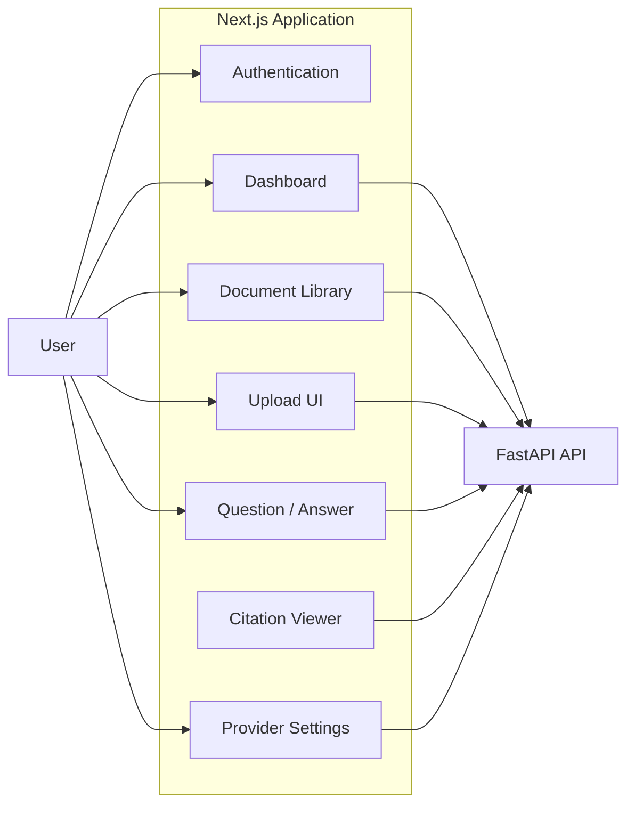
```mermaid
flowchart LR

    USER["User"]

    subgraph NEXT["Next.js Application"]
        AUTH_UI["Authentication"]
        DASH["Dashboard"]
        LIBRARY["Document Library"]
        UPLOAD["Upload UI"]
        CHAT["Question / Answer"]
        CITATIONS["Citation Viewer"]
        SETTINGS["Provider Settings"]
    end

    API["FastAPI API"]

    USER --> AUTH_UI
    USER --> DASH
    USER --> LIBRARY
    USER --> UPLOAD
    USER --> CHAT
    USER --> SETTINGS

    DASH --> API
    LIBRARY --> API
    UPLOAD --> API
    CHAT --> API
    CITATIONS --> API
    SETTINGS --> API
```

## 2.2 Main Frontend Views

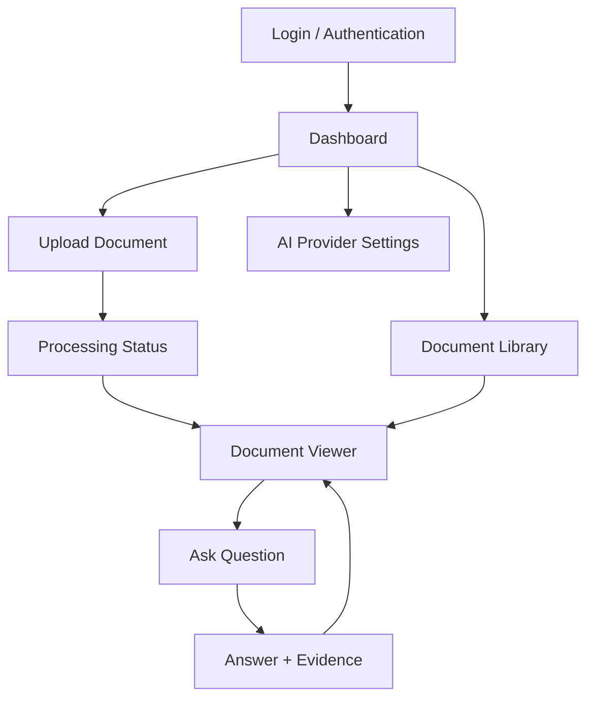
```mermaid
flowchart TB

    LOGIN["Login / Authentication"]

    DASH["Dashboard"]

    LIBRARY["Document Library"]

    UPLOAD["Upload Document"]

    PROCESS["Processing Status"]

    DOCUMENT["Document Viewer"]

    QUERY["Ask Question"]

    RESULTS["Answer + Evidence"]

    PROVIDER["AI Provider Settings"]

    LOGIN --> DASH

    DASH --> LIBRARY
    DASH --> UPLOAD
    DASH --> PROVIDER

    UPLOAD --> PROCESS
    PROCESS --> DOCUMENT

    LIBRARY --> DOCUMENT
    DOCUMENT --> QUERY
    QUERY --> RESULTS

    RESULTS --> DOCUMENT
```

## 2.3 Frontend Responsibilities

The frontend should provide:

* document upload,
* processing status,
* document library,
* question input,
* answer display,
* page citations,
* evidence previews,
* retrieval/debug information,
* provider configuration,
* error states.

The frontend should not:

* directly expose private API credentials,
* perform vector search,
* decide retrieval strategy,
* call internal databases directly,
* contain business-critical AI orchestration.

---

# 3. Backend Architecture

FastAPI provides the main application API.

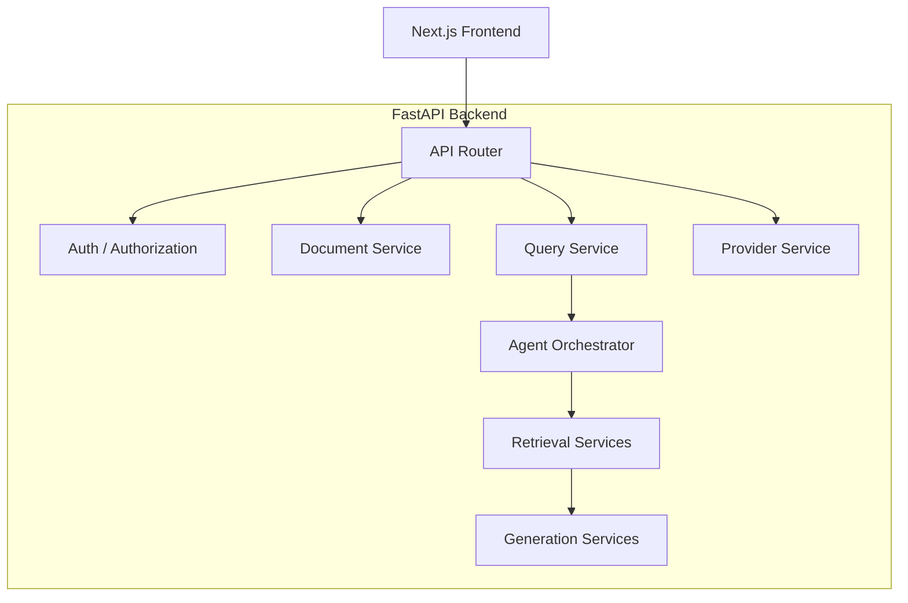
```mermaid
flowchart TB

    CLIENT["Next.js Frontend"]

    subgraph FASTAPI["FastAPI Backend"]

        ROUTER["API Router"]

        AUTH["Auth / Authorization"]

        DOCUMENTS["Document Service"]

        QUERIES["Query Service"]

        PROVIDERS["Provider Service"]

        AGENTS["Agent Orchestrator"]

        RETRIEVAL["Retrieval Services"]

        GENERATION["Generation Services"]

    end

    CLIENT --> ROUTER

    ROUTER --> AUTH
    ROUTER --> DOCUMENTS
    ROUTER --> QUERIES
    ROUTER --> PROVIDERS

    QUERIES --> AGENTS

    AGENTS --> RETRIEVAL
    RETRIEVAL --> GENERATION
```

## Initial API surface

```text
POST   /documents
GET    /documents
GET    /documents/{document_id}
DELETE /documents/{document_id}

POST   /documents/{document_id}/query

GET    /documents/{document_id}/pages/{page_number}

GET    /health
```

Additional endpoints will be added only when required by the product.

---

# 4. Document Ingestion Architecture

The ingestion pipeline converts an uploaded PDF into multiple representations.

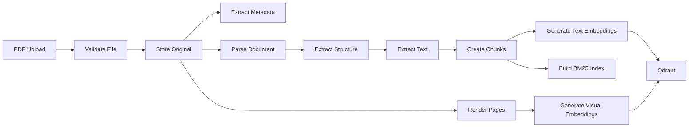
```mermaid
flowchart LR

    PDF["PDF Upload"]

    VALIDATE["Validate File"]

    STORE["Store Original"]

    META["Extract Metadata"]

    PARSE["Parse Document"]

    STRUCT["Extract Structure"]

    TEXT["Extract Text"]

    CHUNK["Create Chunks"]

    RENDER["Render Pages"]

    TEXT_EMBED["Generate Text Embeddings"]

    VIS_EMBED["Generate Visual Embeddings"]

    BM25_INDEX["Build BM25 Index"]

    VECTOR["Qdrant"]

    PDF --> VALIDATE
    VALIDATE --> STORE

    STORE --> META
    STORE --> PARSE
    STORE --> RENDER

    PARSE --> STRUCT
    STRUCT --> TEXT
    TEXT --> CHUNK

    CHUNK --> TEXT_EMBED
    CHUNK --> BM25_INDEX

    RENDER --> VIS_EMBED

    TEXT_EMBED --> VECTOR
    VIS_EMBED --> VECTOR
```

## Processing objectives

The ingestion system should preserve:

* document ID,
* page number,
* text,
* chunk ID,
* page image,
* document metadata,
* extraction metadata.

This allows retrieved evidence to be traced back to its source page.

---

# 5. Retrieval Architecture

DocuLens AI uses multiple retrieval strategies because different retrieval methods solve different problems.

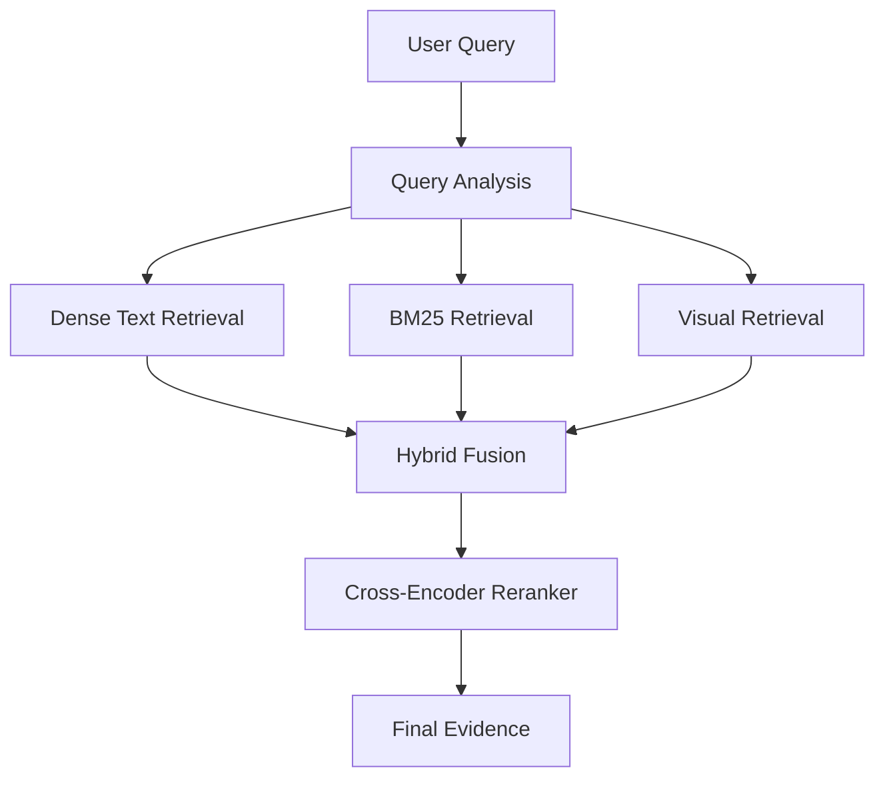
```mermaid
flowchart TB

    QUERY["User Query"]

    ANALYZER["Query Analysis"]

    DENSE["Dense Text Retrieval"]

    SPARSE["BM25 Retrieval"]

    VISUAL["Visual Retrieval"]

    FUSION["Hybrid Fusion"]

    RERANK["Cross-Encoder Reranker"]

    EVIDENCE["Final Evidence"]

    QUERY --> ANALYZER

    ANALYZER --> DENSE
    ANALYZER --> SPARSE
    ANALYZER --> VISUAL

    DENSE --> FUSION
    SPARSE --> FUSION
    VISUAL --> FUSION

    FUSION --> RERANK

    RERANK --> EVIDENCE
```

---

## 5.1 Dense Retrieval

Dense retrieval uses neural embeddings to identify semantically related content.

Example:

```text
Query:
"What methodology did the researchers use?"

Potential evidence:
"Our experimental methodology consisted of..."
```

The wording differs, but the semantic meaning is similar.

Dense retrieval is therefore useful for conceptual and semantic questions.

---

## 5.2 Sparse Retrieval — BM25

BM25 provides lexical retrieval.

It is particularly useful for:

* exact terminology,
* model names,
* dataset names,
* technical identifiers,
* acronyms,
* numbers,
* domain-specific terms.

Example:

```text
Query:
"What BLEU score did the model achieve?"

Important term:
BLEU
```

Dense and sparse retrieval therefore complement each other.

---

## 5.3 Visual Retrieval

Visual retrieval operates on page-level visual representations.

It is particularly useful when relevant information depends on:

* tables,
* figures,
* charts,
* page layout,
* scanned content,
* visually structured information.

The reference architecture recommends page-level visual retrieval for layout-heavy and scanned documents.

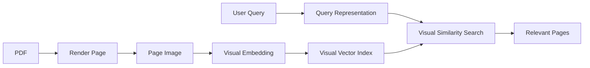
```mermaid
flowchart LR

    PDF["PDF"]

    RENDER["Render Page"]

    PAGE["Page Image"]

    VIS_EMBED["Visual Embedding"]

    INDEX["Visual Vector Index"]

    QUERY["User Query"]

    Q_EMBED["Query Representation"]

    SEARCH["Visual Similarity Search"]

    RESULTS["Relevant Pages"]

    PDF --> RENDER
    RENDER --> PAGE
    PAGE --> VIS_EMBED
    VIS_EMBED --> INDEX

    QUERY --> Q_EMBED
    Q_EMBED --> SEARCH
    INDEX --> SEARCH
    SEARCH --> RESULTS
```

---

# 6. Hybrid Retrieval and Fusion

No single retrieval mechanism should be assumed to work best for every query.

DocuLens combines:

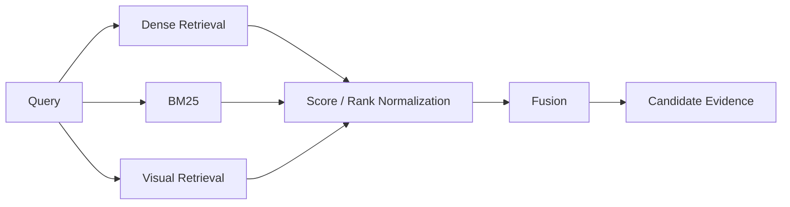
```mermaid
flowchart LR

    QUERY["Query"]

    DENSE["Dense Retrieval"]
    BM25["BM25"]
    VISUAL["Visual Retrieval"]

    NORMALIZE["Score / Rank Normalization"]

    FUSION["Fusion"]

    CANDIDATES["Candidate Evidence"]

    QUERY --> DENSE
    QUERY --> BM25
    QUERY --> VISUAL

    DENSE --> NORMALIZE
    BM25 --> NORMALIZE
    VISUAL --> NORMALIZE

    NORMALIZE --> FUSION

    FUSION --> CANDIDATES
```

Initial fusion strategies:

* weighted score fusion,
* Reciprocal Rank Fusion.

The first implementation should remain simple enough to benchmark and explain.

---

# 7. Reranking and Grounding

Retrieval produces candidate evidence.

Reranking determines which candidates are most relevant.

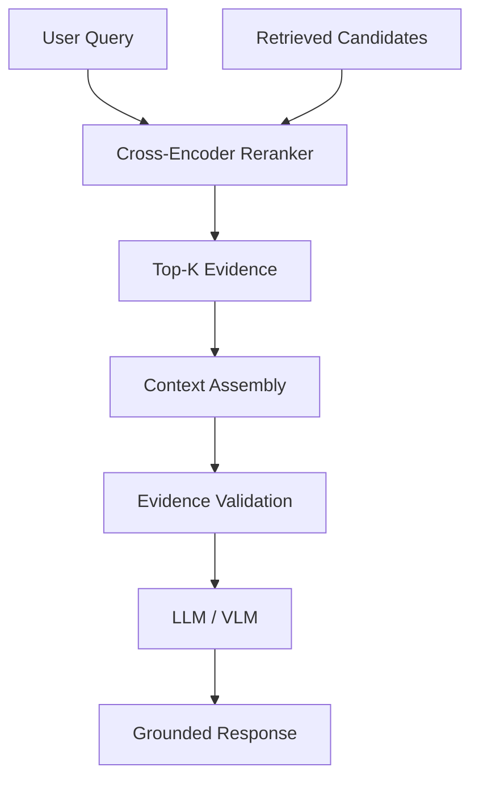
```mermaid
flowchart TB

    QUERY["User Query"]

    CANDIDATES["Retrieved Candidates"]

    RERANK["Cross-Encoder Reranker"]

    TOPK["Top-K Evidence"]

    CONTEXT["Context Assembly"]

    VALIDATE["Evidence Validation"]

    GENERATE["LLM / VLM"]

    RESPONSE["Grounded Response"]

    QUERY --> RERANK
    CANDIDATES --> RERANK

    RERANK --> TOPK

    TOPK --> CONTEXT
    CONTEXT --> VALIDATE

    VALIDATE --> GENERATE

    GENERATE --> RESPONSE
```

The objective is to avoid passing a large amount of weak evidence into the generation model.

Conceptually:

```text
100 candidates
      ↓
fusion
      ↓
20 candidates
      ↓
reranking
      ↓
5 strong candidates
      ↓
grounded generation
```

---

# 8. Agent Architecture

Agents are used selectively for orchestration.

The system should not make every component autonomous.

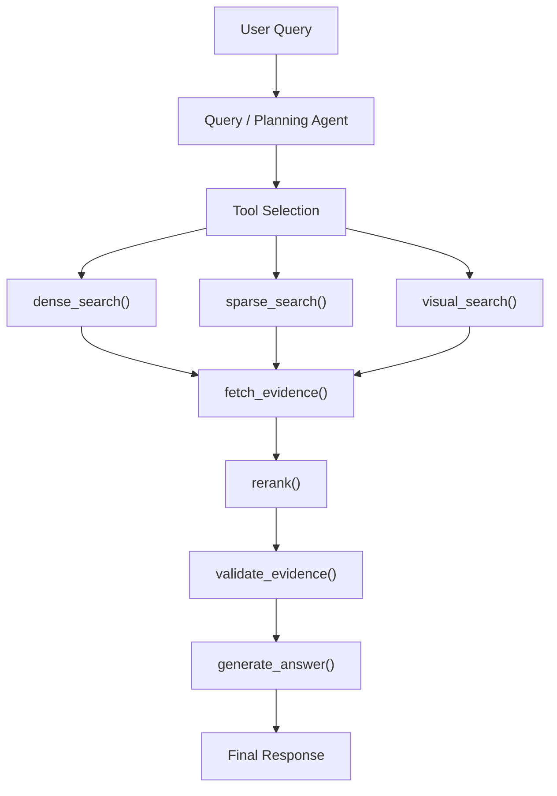
```mermaid
flowchart TB

    USER_QUERY["User Query"]

    PLANNER["Query / Planning Agent"]

    TOOL_ROUTER["Tool Selection"]

    DENSE["dense_search()"]

    BM25["sparse_search()"]

    VISUAL["visual_search()"]

    FETCH["fetch_evidence()"]

    RERANK["rerank()"]

    VALIDATE["validate_evidence()"]

    ANSWER["generate_answer()"]

    RESPONSE["Final Response"]

    USER_QUERY --> PLANNER

    PLANNER --> TOOL_ROUTER

    TOOL_ROUTER --> DENSE
    TOOL_ROUTER --> BM25
    TOOL_ROUTER --> VISUAL

    DENSE --> FETCH
    BM25 --> FETCH
    VISUAL --> FETCH

    FETCH --> RERANK
    RERANK --> VALIDATE

    VALIDATE --> ANSWER
    ANSWER --> RESPONSE
```

## Agent boundaries

The agent should have access only to explicitly defined tools.

Example:

```text
dense_search(query, document_ids, top_k)

sparse_search(query, document_ids, top_k)

visual_search(query, document_ids, top_k)

fetch_evidence(document_id, page_number)

rerank(query, candidates)

validate_evidence(evidence)
```

The agent should not have unrestricted access to:

* databases,
* filesystem commands,
* shell execution,
* arbitrary HTTP requests,
* credentials,
* internal infrastructure.

This makes the system's agentic behavior bounded, testable, and observable.

---

# 9. Generation Architecture

The generation layer receives:

```text
User Question
+
Retrieved Evidence
+
Document Metadata
+
Page Information
```

and produces a structured grounded response.

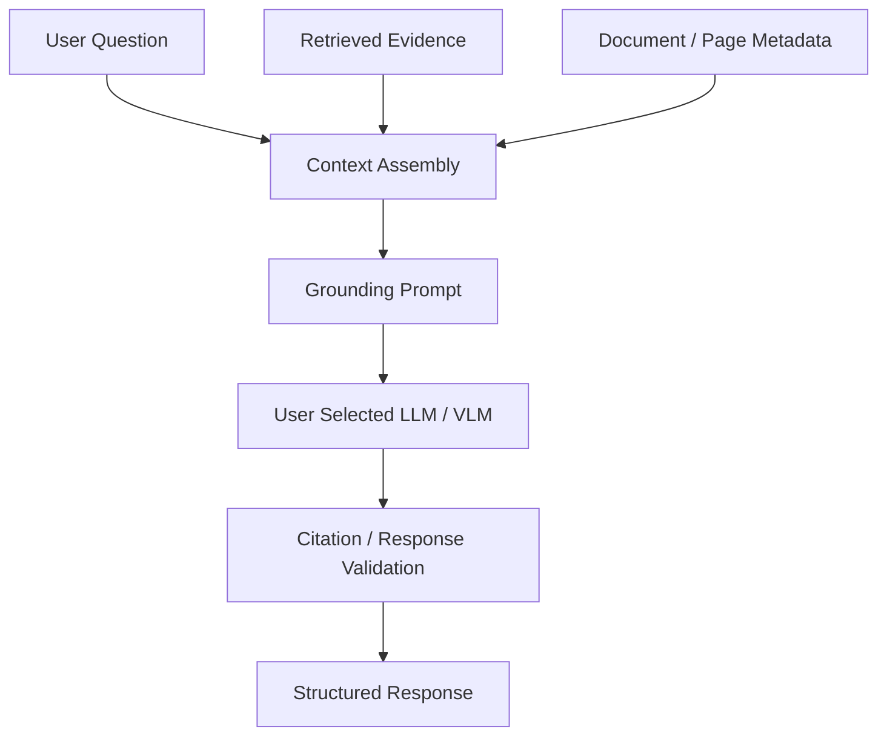
```mermaid
flowchart TB

    QUESTION["User Question"]

    EVIDENCE["Retrieved Evidence"]

    METADATA["Document / Page Metadata"]

    CONTEXT["Context Assembly"]

    PROMPT["Grounding Prompt"]

    MODEL["User Selected LLM / VLM"]

    VALIDATE["Citation / Response Validation"]

    RESPONSE["Structured Response"]

    QUESTION --> CONTEXT
    EVIDENCE --> CONTEXT
    METADATA --> CONTEXT

    CONTEXT --> PROMPT
    PROMPT --> MODEL

    MODEL --> VALIDATE
    VALIDATE --> RESPONSE
```

Target response:

```json
{
  "answer": "The authors evaluated...",
  "citations": [
    {
      "document_id": "doc_123",
      "page": 7,
      "evidence_text": "..."
    }
  ]
}
```

If sufficient evidence cannot be found, the system should prefer an explicit limitation response rather than unsupported generation.

---

# 10. BYOK Architecture

DocuLens AI follows a **Bring Your Own Key** model for external AI inference.

Users provide their own provider credentials.

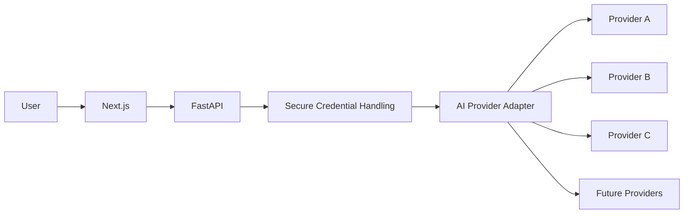
```mermaid
flowchart LR

    USER["User"]

    FRONTEND["Next.js"]

    API["FastAPI"]

    CREDENTIAL["Secure Credential Handling"]

    ADAPTER["AI Provider Adapter"]

    OPENAI["Provider A"]
    ANTHROPIC["Provider B"]
    GOOGLE["Provider C"]
    FUTURE["Future Providers"]

    USER --> FRONTEND

    FRONTEND --> API

    API --> CREDENTIAL
    CREDENTIAL --> ADAPTER

    ADAPTER --> OPENAI
    ADAPTER --> ANTHROPIC
    ADAPTER --> GOOGLE
    ADAPTER --> FUTURE
```

## Provider abstraction

The application should use a provider interface rather than coupling business logic to one vendor.

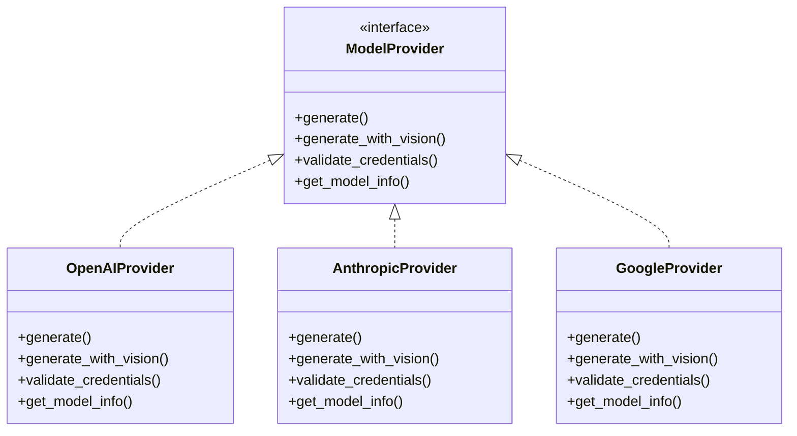
```mermaid
classDiagram

    class ModelProvider {
        <<interface>>
        +generate()
        +generate_with_vision()
        +validate_credentials()
        +get_model_info()
    }

    class OpenAIProvider {
        +generate()
        +generate_with_vision()
        +validate_credentials()
        +get_model_info()
    }

    class AnthropicProvider {
        +generate()
        +generate_with_vision()
        +validate_credentials()
        +get_model_info()
    }

    class GoogleProvider {
        +generate()
        +generate_with_vision()
        +validate_credentials()
        +get_model_info()
    }

    ModelProvider <|.. OpenAIProvider
    ModelProvider <|.. AnthropicProvider
    ModelProvider <|.. GoogleProvider
```

The exact supported providers will be determined during implementation based on the selected SDKs/models and their current capabilities.

---

# 11. Storage Architecture

The initial architecture uses three storage categories.

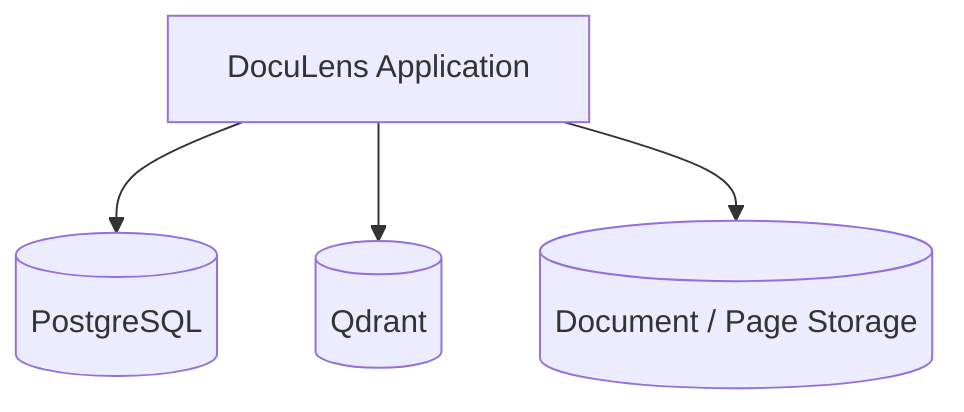
```mermaid
flowchart TB

    APP["DocuLens Application"]

    POSTGRES[("PostgreSQL")]
    QDRANT[("Qdrant")]
    OBJECT[("Document / Page Storage")]

    APP --> POSTGRES
    APP --> QDRANT
    APP --> OBJECT
```

## PostgreSQL

Stores application metadata such as:

```text
users
documents
pages
processing_jobs
provider_configurations
queries
usage_records
```

## Qdrant

Stores vector representations and retrieval metadata.

Potential collections:

```text
text_embeddings
visual_embeddings
```

The exact collection strategy will be validated during implementation.

## Document storage

Stores:

* original PDFs,
* rendered page images,
* derived document assets.

Local development can use filesystem storage.

Cloud deployment can later use object storage.

---

# 12. Data Model

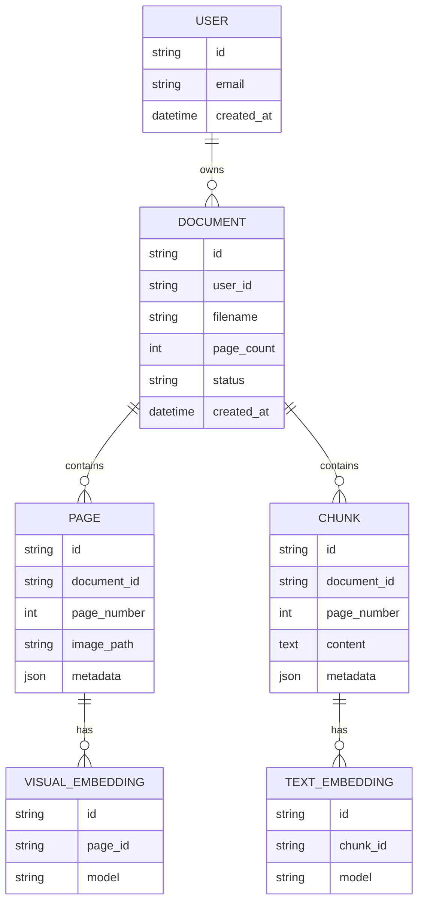
```mermaid
erDiagram

    USER ||--o{ DOCUMENT : owns

    DOCUMENT ||--o{ PAGE : contains

    DOCUMENT ||--o{ CHUNK : contains

    PAGE ||--o{ VISUAL_EMBEDDING : has

    CHUNK ||--o{ TEXT_EMBEDDING : has

    DOCUMENT {
        string id
        string user_id
        string filename
        int page_count
        string status
        datetime created_at
    }

    PAGE {
        string id
        string document_id
        int page_number
        string image_path
        json metadata
    }

    CHUNK {
        string id
        string document_id
        int page_number
        text content
        json metadata
    }

    TEXT_EMBEDDING {
        string id
        string chunk_id
        string model
    }

    VISUAL_EMBEDDING {
        string id
        string page_id
        string model
    }

    USER {
        string id
        string email
        datetime created_at
    }
```

The key design principle is **traceability**:

```text
Embedding
   ↓
Chunk / Page
   ↓
Document
   ↓
User
```

This enables citation generation and user-level document isolation.

---

# 13. Security Architecture

Security is particularly important because the system handles:

* user documents,
* provider credentials,
* potentially sensitive information.

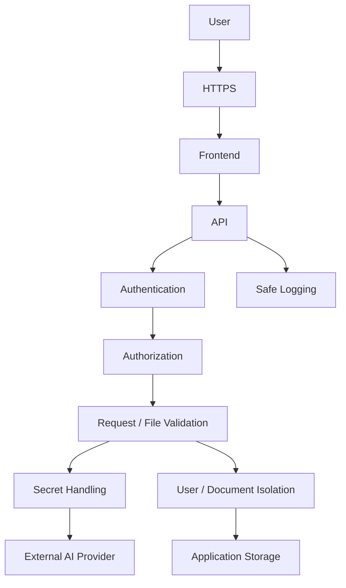
```mermaid
flowchart TB

    USER["User"]

    HTTPS["HTTPS"]

    FRONTEND["Frontend"]

    API["API"]

    AUTH["Authentication"]

    AUTHZ["Authorization"]

    VALIDATION["Request / File Validation"]

    SECRETS["Secret Handling"]

    ISOLATION["User / Document Isolation"]

    LOGGING["Safe Logging"]

    PROVIDER["External AI Provider"]

    STORAGE["Application Storage"]

    USER --> HTTPS
    HTTPS --> FRONTEND
    FRONTEND --> API

    API --> AUTH
    AUTH --> AUTHZ
    AUTHZ --> VALIDATION

    VALIDATION --> SECRETS
    VALIDATION --> ISOLATION

    ISOLATION --> STORAGE
    SECRETS --> PROVIDER

    API --> LOGGING
```

Security requirements include:

* never commit provider API keys,
* never expose server-side secrets to the browser,
* never log raw credentials,
* validate uploaded files,
* enforce file-size limits,
* isolate documents by user,
* authorize document access,
* protect internal APIs,
* validate model responses,
* restrict agent tools,
* avoid sensitive information in traces.

Security controls will evolve as authentication, multi-user behavior, and cloud deployment are introduced.

---

# 14. Observability Architecture

The system should record enough information to understand performance and failures.

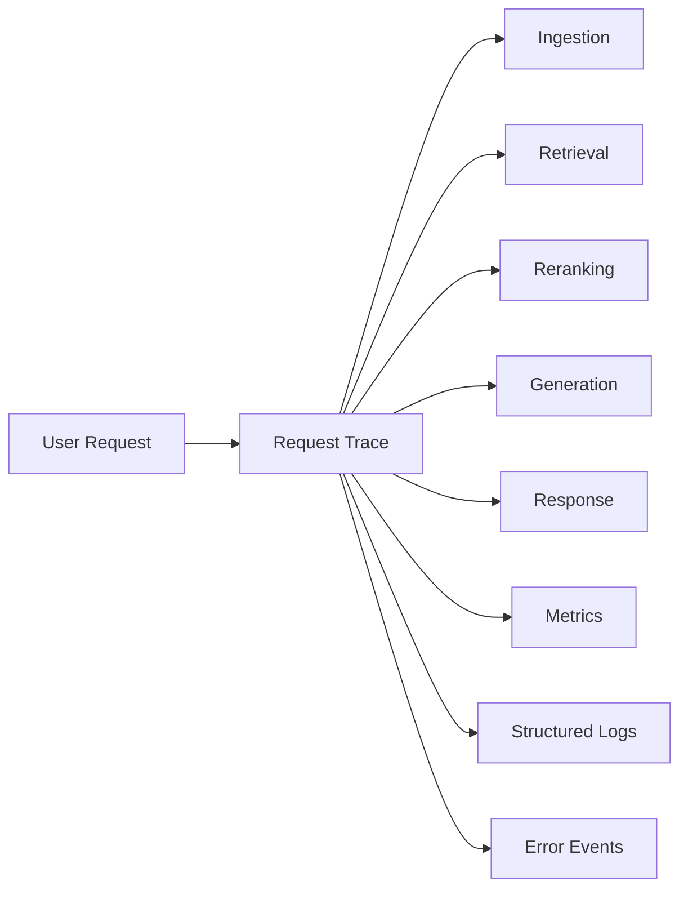
```mermaid
flowchart LR

    REQUEST["User Request"]

    TRACE["Request Trace"]

    INGEST["Ingestion"]

    RETRIEVAL["Retrieval"]

    RERANK["Reranking"]

    GENERATION["Generation"]

    RESPONSE["Response"]

    METRICS["Metrics"]

    LOGS["Structured Logs"]

    ERRORS["Error Events"]

    REQUEST --> TRACE

    TRACE --> INGEST
    TRACE --> RETRIEVAL
    TRACE --> RERANK
    TRACE --> GENERATION
    TRACE --> RESPONSE

    TRACE --> METRICS
    TRACE --> LOGS
    TRACE --> ERRORS
```

Important measurements:

```text
ingestion latency
page count
chunk count
retrieval latency
dense retrieval count
BM25 retrieval count
visual retrieval count
reranking latency
generation latency
token usage
model/provider
failure type
```

Example trace:

```text
Query ID: q_123

Query analysis:       80 ms
Dense retrieval:     120 ms
BM25 retrieval:       35 ms
Visual retrieval:    410 ms
Fusion:                 5 ms
Reranking:            180 ms
Generation:          1520 ms

Total:               2350 ms
```

The reference specifically identifies ingestion, retrieval, generation latency and failure logging as important production considerations.

---

# 15. Deployment Architecture

The first deployment target is Docker Compose.

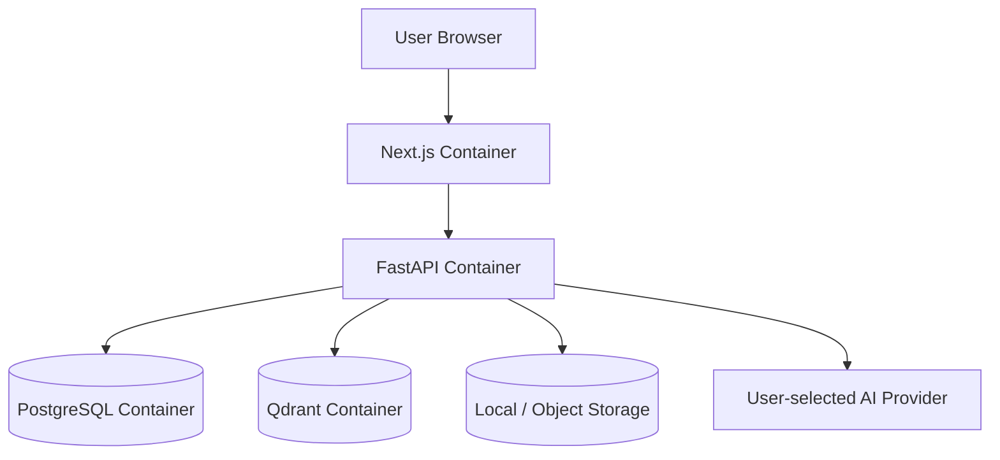
```mermaid
flowchart TB

    USER["User Browser"]

    FRONTEND["Next.js Container"]

    BACKEND["FastAPI Container"]

    POSTGRES[("PostgreSQL Container")]

    QDRANT[("Qdrant Container")]

    STORAGE[("Local / Object Storage")]

    AI["User-selected AI Provider"]

    USER --> FRONTEND

    FRONTEND --> BACKEND

    BACKEND --> POSTGRES
    BACKEND --> QDRANT
    BACKEND --> STORAGE

    BACKEND --> AI
```

## Development deployment

```text
Docker Compose
├── frontend
├── backend
├── postgres
└── qdrant
```

Document processing and model workloads may run inside the backend initially.

If workload characteristics justify separation later, background workers can be introduced.

---

# 16. End-to-End Workflow

## 16.1 Document ingestion workflow

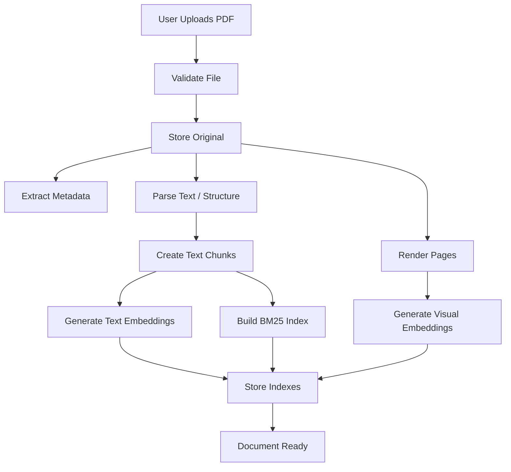
```mermaid
flowchart TD

    A["User Uploads PDF"]

    B["Validate File"]

    C["Store Original"]

    D["Extract Metadata"]

    E["Parse Text / Structure"]

    F["Render Pages"]

    G["Create Text Chunks"]

    H["Generate Text Embeddings"]

    I["Generate Visual Embeddings"]

    J["Build BM25 Index"]

    K["Store Indexes"]

    L["Document Ready"]

    A --> B
    B --> C

    C --> D
    C --> E
    C --> F

    E --> G
    G --> H
    G --> J

    F --> I

    H --> K
    I --> K
    J --> K

    K --> L
```

---

## 16.2 Query workflow

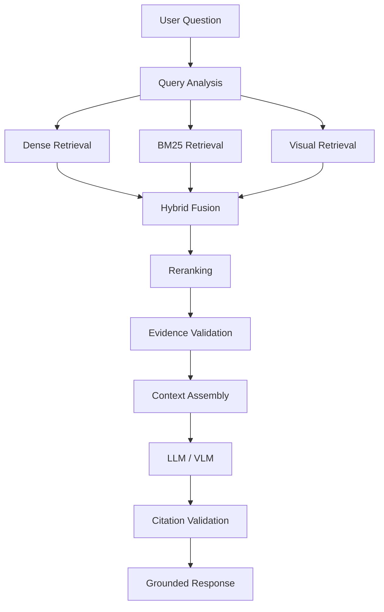
```mermaid
flowchart TD

    A["User Question"]

    B["Query Analysis"]

    C["Dense Retrieval"]

    D["BM25 Retrieval"]

    E["Visual Retrieval"]

    F["Hybrid Fusion"]

    G["Reranking"]

    H["Evidence Validation"]

    I["Context Assembly"]

    J["LLM / VLM"]

    K["Citation Validation"]

    L["Grounded Response"]

    A --> B

    B --> C
    B --> D
    B --> E

    C --> F
    D --> F
    E --> F

    F --> G
    G --> H

    H --> I
    I --> J

    J --> K
    K --> L
```

---

# 17. Architecture Evolution

DocuLens AI will evolve incrementally rather than starting with the complete advanced architecture.

```mermaid
flowchart LR

    MVP["MVP<br/>Text RAG"]

    V1["V1<br/>Multimodal Retrieval"]

    AGENT["Agentic<br/>Orchestration"]

    EVAL["Evaluation<br/>& Experiments"]

    PRODUCT["Full Product<br/>Frontend + BYOK"]

    PROD["Production-Oriented<br/>Security + Observability"]

    SCALE["Advanced<br/>Cloud / Scaling"]

    MVP --> V1
    V1 --> AGENT
    AGENT --> EVAL
    EVAL --> PRODUCT
    PRODUCT --> PROD
    PROD --> SCALE
```

## 17.1 MVP

```mermaid
flowchart LR

    PDF["PDF"]

    TEXT["Text Extraction"]

    CHUNK["Chunking"]

    EMBED["Dense Embeddings"]

    VECTOR["Vector Search"]

    LLM["LLM"]

    ANSWER["Answer + Citation"]

    PDF --> TEXT
    TEXT --> CHUNK
    CHUNK --> EMBED
    EMBED --> VECTOR

    VECTOR --> LLM
    LLM --> ANSWER
```

### MVP objectives

* prove document ingestion,
* prove retrieval,
* prove generation,
* establish baseline metrics,
* preserve page-level metadata.

---

## 17.2 V1 — Multimodal Retrieval

```mermaid
flowchart TB

    PDF["PDF"]

    TEXT["Text + Structure"]

    PAGES["Rendered Pages"]

    DENSE["Dense Retrieval"]

    BM25["BM25"]

    VISUAL["Visual Retrieval"]

    FUSION["Hybrid Fusion"]

    RERANK["Reranker"]

    GENERATE["Grounded LLM / VLM"]

    RESPONSE["Answer + Evidence"]

    PDF --> TEXT
    PDF --> PAGES

    TEXT --> DENSE
    TEXT --> BM25
    PAGES --> VISUAL

    DENSE --> FUSION
    BM25 --> FUSION
    VISUAL --> FUSION

    FUSION --> RERANK
    RERANK --> GENERATE

    GENERATE --> RESPONSE
```

---

## 17.3 Agentic Layer

```mermaid
flowchart TB

    QUERY["User Query"]

    AGENT["Bounded Query Agent"]

    TOOLS["Approved Retrieval Tools"]

    RETRIEVAL["Retrieval System"]

    VALIDATOR["Evidence Validator"]

    GENERATOR["Answer Generator"]

    RESPONSE["Grounded Response"]

    QUERY --> AGENT
    AGENT --> TOOLS
    TOOLS --> RETRIEVAL
    RETRIEVAL --> VALIDATOR

    VALIDATOR --> GENERATOR
    GENERATOR --> RESPONSE
```

Agents are introduced only after the underlying retrieval capabilities exist and can be tested independently.

---

## 17.4 Full Product Architecture

```mermaid
flowchart TB

    USER["User"]

    subgraph PRODUCT["DocuLens AI"]

        FRONTEND["Next.js Frontend"]

        API["FastAPI"]

        AUTH["Authentication"]

        DOCS["Document Service"]

        ORCH["Agent Orchestrator"]

        RET["Hybrid Retrieval"]

        RERANK["Reranker"]

        GROUND["Grounding"]

        PROVIDER["Provider Adapter"]

    end

    subgraph DATA["Data Layer"]

        POSTGRES[("PostgreSQL")]

        QDRANT[("Qdrant")]

        OBJECT[("Object Storage")]

    end

    subgraph AI["User AI Provider"]

        LLM["LLM"]

        VLM["VLM"]

    end

    USER --> FRONTEND
    FRONTEND --> API

    API --> AUTH
    API --> DOCS
    API --> ORCH

    DOCS --> POSTGRES
    DOCS --> OBJECT

    ORCH --> RET
    RET --> QDRANT
    RET --> RERANK

    RERANK --> GROUND
    GROUND --> PROVIDER

    PROVIDER --> LLM
    PROVIDER --> VLM

    GROUND --> API
    API --> FRONTEND
```

---

## Architecture Evolution Principle

The architecture follows this progression:

```mermaid
flowchart LR

    SIMPLE["Simple"]

    BASELINE["Text Retrieval"]

    MULTI["Multimodal Retrieval"]

    HYBRID["Hybrid + Reranking"]

    AGENTIC["Bounded Agents"]

    EVALUATED["Measured System"]

    SECURE["Secure Product"]

    OBSERVED["Observable System"]

    DEPLOYED["Deployable System"]

    SIMPLE --> BASELINE
    BASELINE --> MULTI
    MULTI --> HYBRID
    HYBRID --> AGENTIC
    AGENTIC --> EVALUATED
    EVALUATED --> SECURE
    SECURE --> OBSERVED
    OBSERVED --> DEPLOYED
```

Each architectural expansion should be justified by one or more of:

* a demonstrated retrieval limitation,
* an evaluation result,
* a product requirement,
* a reliability requirement,
* a security requirement,
* a performance requirement,
* or a deployment requirement.

The project should not introduce infrastructure simply to make the architecture diagram appear more complex.

---

# Architectural Principles

## Principle 1 — Baseline First

The text-only retrieval system is the experimental baseline.

Every major retrieval improvement should be compared against it.

## Principle 2 — Evidence Before Generation

The generation model should receive retrieved evidence rather than being expected to independently search the entire document corpus.

## Principle 3 — Multimodality Where It Adds Value

Visual retrieval exists to solve document problems that text-only retrieval cannot reliably solve.

## Principle 4 — Bounded Agents

Agents receive explicit tools and constrained responsibilities.

Deterministic operations remain deterministic where practical.

## Principle 5 — Provider Independence

External model inference should use a provider abstraction so that the application is not tightly coupled to a single model vendor.

## Principle 6 — BYOK

Users provide their own external AI provider credentials.

Project-owned API credentials are not used to provide unrestricted inference to end users.

## Principle 7 — Traceability

Retrieved evidence must preserve document and page identity so that answers can be grounded and inspected.

## Principle 8 — Measured Improvement

No architectural component should be considered an improvement until experiments demonstrate its effect.

## Principle 9 — Incremental Complexity

Start with a working system and introduce complexity only when the system requires it.

## Principle 10 — Honest Claims

The project will distinguish between:

* planned capabilities,
* implemented capabilities,
* measured results,
* and future work.

No performance, scale, accuracy, or production-readiness claim should be made without supporting evidence.
