# DocuLens AI — System Architecture

> **Multimodal Document Intelligence with Grounded AI**

DocuLens AI is a multimodal document intelligence platform that processes complex documents, retrieves evidence from both textual and visual representations, and generates grounded answers with page-level citations.

The architecture is designed to evolve from a simple text-based retrieval baseline into a multimodal, agent-assisted, evaluated, observable, and deployable AI system.

---

# 1. High-Level Architecture

## 1.1 Current Implemented System Overview

DocuLens AI consists of five operational architectural layers:

1. **Frontend Layer** — Next.js 16 (App Router) user interface for document upload, library management, split-screen PDF page rendering, evidence citation inspection, and pipeline telemetry observability.
2. **API / Application Layer** — FastAPI ASGI service providing typed REST contracts, request validation, rate limiting, and end-to-end RAG pipeline orchestration.
3. **Document Intelligence Layer** — Magic-byte validation, PyPDF text extraction, PyMuPDF 150-DPI page rendering, recursive character chunking (500 chars / 50 overlap), and FastEmbed dense/visual embeddings.
4. **Retrieval & Grounding Layer** — Dense vector search, sparse BM25Okapi lexical retrieval, visual layout retrieval, Reciprocal Rank Fusion (RRF k=60), cross-encoder reranking, and citation grounding verification.
5. **Infrastructure & Storage Layer** — Lightweight, local-first storage: embedded Qdrant vector store (`QDRANT_LOCATION=":memory:"` default or local directory), in-memory BM25 index, local filesystem vault (`data/uploads`, `data/rendered_pages`), and BYOK AI provider adapters.

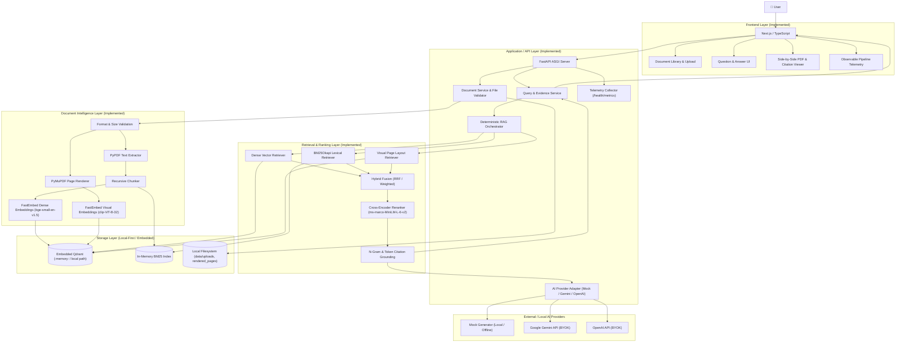
```mermaid
flowchart TB

    USER["👤 User"]

    subgraph FRONTEND["Frontend Layer (Implemented)"]
        UI["Next.js / TypeScript"]
        DOC_UI["Document Library & Upload"]
        QUERY_UI["Question & Answer UI"]
        EVIDENCE_UI["Side-by-Side PDF & Citation Viewer"]
        TELEMETRY_UI["Observable Pipeline Telemetry"]
    end

    subgraph API["Application / API Layer (Implemented)"]
        FASTAPI["FastAPI ASGI Server"]
        DOC_SERVICE["Document Service & File Validator"]
        QUERY_SERVICE["Query & Evidence Service"]
        PIPELINE["Deterministic RAG Orchestrator"]
        METRICS["Telemetry Collector (/health/metrics)"]
        PROVIDER["AI Provider Adapter (Mock / Gemini / OpenAI)"]
    end

    subgraph DOCUMENT["Document Intelligence Layer (Implemented)"]
        VALIDATE["Format & Size Validation"]
        PARSE["PyPDF Text Extractor"]
        RENDER["PyMuPDF Page Renderer"]
        CHUNK["Recursive Chunker"]
        TEXT_EMBED["FastEmbed Dense Embeddings (bge-small-en-v1.5)"]
        VISUAL_EMBED["FastEmbed Visual Embeddings (clip-ViT-B-32)"]
    end

    subgraph RETRIEVAL["Retrieval & Ranking Layer (Implemented)"]
        DENSE["Dense Vector Retriever"]
        BM25["BM25Okapi Lexical Retriever"]
        VISUAL["Visual Page Layout Retriever"]
        FUSION["Hybrid Fusion (RRF / Weighted)"]
        RERANK["Cross-Encoder Reranker (ms-marco-MiniLM-L-6-v2)"]
        GROUND["N-Gram & Token Citation Grounding"]
    end

    subgraph STORAGE["Storage Layer (Local-First / Embedded)"]
        QDRANT[("Embedded Qdrant (:memory: / local path)")]
        BM25_STORE[("In-Memory BM25 Index")]
        FILESTORE[("Local Filesystem (data/uploads, rendered_pages)")]
    end

    subgraph AI["External / Local AI Providers"]
        MOCK["Mock Generator (Local / Offline)"]
        GEMINI["Google Gemini API (BYOK)"]
        OPENAI["OpenAI API (BYOK)"]
    end

    USER --> UI

    UI --> DOC_UI
    UI --> QUERY_UI
    UI --> EVIDENCE_UI
    UI --> TELEMETRY_UI

    UI --> FASTAPI

    FASTAPI --> DOC_SERVICE
    FASTAPI --> QUERY_SERVICE
    FASTAPI --> METRICS

    DOC_SERVICE --> VALIDATE
    VALIDATE --> PARSE
    VALIDATE --> RENDER
    PARSE --> CHUNK

    CHUNK --> TEXT_EMBED
    CHUNK --> BM25_STORE
    RENDER --> VISUAL_EMBED
    DOC_SERVICE --> FILESTORE

    TEXT_EMBED --> QDRANT
    VISUAL_EMBED --> QDRANT

    QUERY_SERVICE --> PIPELINE
    PIPELINE --> DENSE
    PIPELINE --> BM25
    PIPELINE --> VISUAL

    DENSE --> QDRANT
    BM25 --> BM25_STORE
    VISUAL --> QDRANT

    DENSE --> FUSION
    BM25 --> FUSION
    VISUAL --> FUSION

    FUSION --> RERANK
    RERANK --> GROUND

    GROUND --> PROVIDER
    PROVIDER --> MOCK
    PROVIDER --> GEMINI
    PROVIDER --> OPENAI

    GROUND --> QUERY_SERVICE
    QUERY_SERVICE --> UI
```

## 1.2 Planned / Future Architecture Extensions

The following enterprise infrastructure modules are **planned for future phases** and are intentionally not present in the current lightweight baseline:

* **PostgreSQL / Relational Metadata**: Planned for multi-user persistent accounts, query histories, and enterprise audit trails.
* **External Distributed Qdrant**: Planned for horizontal multi-node scaling when corpus sizes exceed single-host embedded memory/disk.
* **Cloud Object Storage (S3 / GCS / Azure Blob)**: Planned for cloud-native deployments replacing local filesystem storage.
* **Authentication & RBAC**: Planned for multi-user multi-tenant access control and organization workspaces.
* **Bounded Agentic Orchestration**: Planned for Phase 11 to introduce LLM tool-calling and query planning only where experimentally proven superior to deterministic RAG pipelines.
* **Background Worker Queues (Redis / Celery)**: Planned for high-throughput batch document ingestion workflows.

---

# 2. Frontend Architecture

## 2.1 Frontend Technology

The frontend uses:

* Next.js
* TypeScript
* React
* component-based UI
* API-driven communication with FastAPI

The frontend is responsible for presentation and user interaction.

It should not contain provider API secrets or implement core retrieval logic.

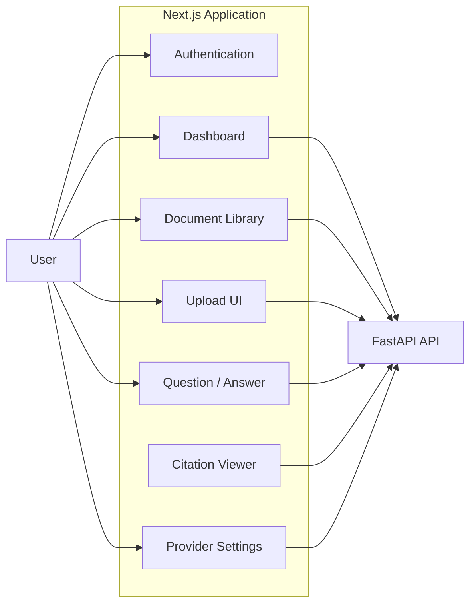
```mermaid
flowchart LR

    USER["User"]

    subgraph NEXT["Next.js Application"]
        AUTH_UI["Authentication"]
        DASH["Dashboard"]
        LIBRARY["Document Library"]
        UPLOAD["Upload UI"]
        CHAT["Question / Answer"]
        CITATIONS["Citation Viewer"]
        SETTINGS["Provider Settings"]
    end

    API["FastAPI API"]

    USER --> AUTH_UI
    USER --> DASH
    USER --> LIBRARY
    USER --> UPLOAD
    USER --> CHAT
    USER --> SETTINGS

    DASH --> API
    LIBRARY --> API
    UPLOAD --> API
    CHAT --> API
    CITATIONS --> API
    SETTINGS --> API
```

## 2.2 Main Frontend Views

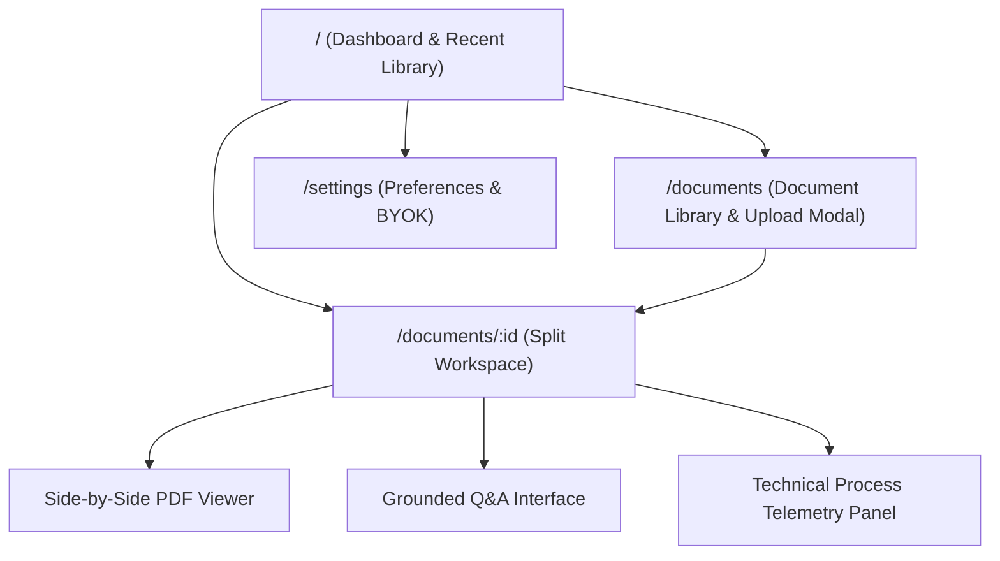
```mermaid
flowchart TB

    HOME["/ (Dashboard & Recent Library)"]

    LIBRARY["/documents (Document Library & Upload Modal)"]

    WORKSPACE["/documents/:id (Split Workspace)"]

    VIEWER["Side-by-Side PDF Viewer"]

    QA["Grounded Q&A Interface"]

    TELEMETRY["Technical Process Telemetry Panel"]

    SETTINGS["/settings (Preferences & BYOK)"]

    HOME --> LIBRARY
    HOME --> WORKSPACE
    HOME --> SETTINGS

    LIBRARY --> WORKSPACE

    WORKSPACE --> VIEWER
    WORKSPACE --> QA
    WORKSPACE --> TELEMETRY
```

## 2.3 Frontend Responsibilities

The frontend should provide:

* document upload,
* processing status,
* document library,
* question input,
* answer display,
* page citations,
* evidence previews,
* retrieval/debug information,
* provider configuration,
* error states.

The frontend should not:

* directly expose private API credentials,
* perform vector search,
* decide retrieval strategy,
* call internal databases directly,
* contain business-critical AI orchestration.

---

# 3. Backend Architecture

FastAPI provides the main application API.

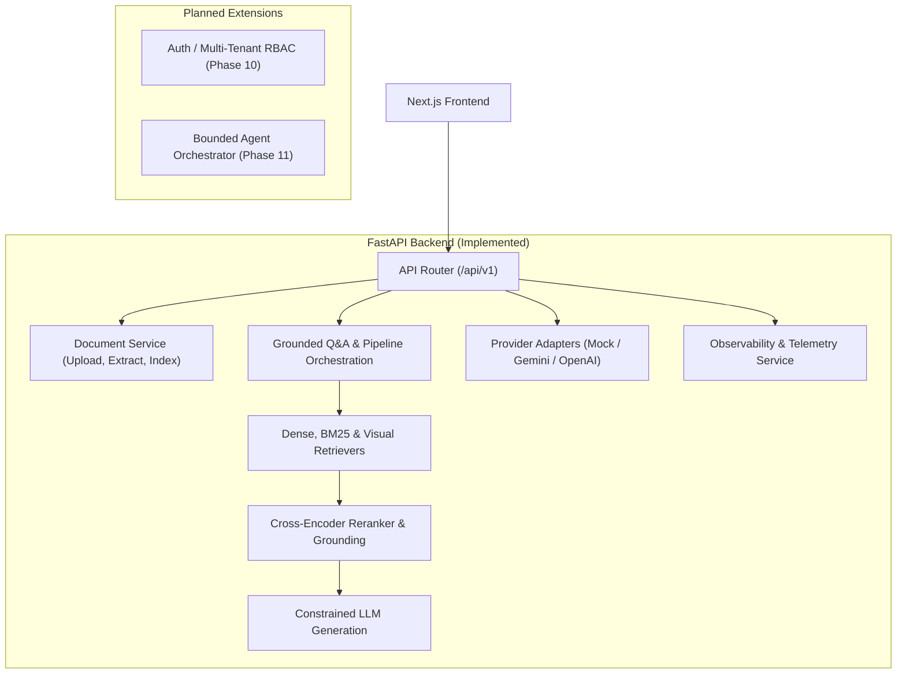
```mermaid
flowchart TB

    CLIENT["Next.js Frontend"]

    subgraph FASTAPI["FastAPI Backend (Implemented)"]

        ROUTER["API Router (/api/v1)"]

        DOCUMENTS["Document Service (Upload, Extract, Index)"]

        QUERIES["Grounded Q&A & Pipeline Orchestration"]

        PROVIDERS["Provider Adapters (Mock / Gemini / OpenAI)"]

        METRICS["Observability & Telemetry Service"]

        RETRIEVAL["Dense, BM25 & Visual Retrievers"]

        RERANKING["Cross-Encoder Reranker & Grounding"]

        GENERATION["Constrained LLM Generation"]

    end

    subgraph PLANNED["Planned Extensions"]
        AUTH["Auth / Multi-Tenant RBAC (Phase 10)"]
        AGENTS["Bounded Agent Orchestrator (Phase 11)"]
    end

    CLIENT --> ROUTER

    ROUTER --> DOCUMENTS
    ROUTER --> QUERIES
    ROUTER --> PROVIDERS
    ROUTER --> METRICS

    QUERIES --> RETRIEVAL
    RETRIEVAL --> RERANKING
    RERANKING --> GENERATION
```

## Implemented API Surface

```text
# Document Management & Ingestion
POST   /api/v1/documents/upload                       # Upload PDF with magic-byte validation
GET    /api/v1/documents                              # List uploaded document metadata
GET    /api/v1/documents/{document_id}                # Retrieve document details & status
DELETE /api/v1/documents/{document_id}                # Delete document, chunks & page assets
POST   /api/v1/documents/{document_id}/extract        # Extract text layout & page images
POST   /api/v1/documents/{document_id}/index          # Chunk, embed (text+visual) & index BM25
GET    /api/v1/documents/{document_id}/pages/{n}/image# Fetch rendered page image PNG

# Grounded Question Answering & Hybrid Retrieval
POST   /api/v1/documents/{document_id}/ask            # Grounded Q&A with page-level citations
POST   /api/v1/documents/ask                          # Cross-collection grounded Q&A

# Health & Observability
GET    /api/v1/health                                 # Process liveness check
GET    /api/v1/health/ready                           # Deep readiness probe (storage, Qdrant, LLM)
GET    /api/v1/health/metrics                         # Ingestion, retrieval, LLM & HTTP metrics
```

---

# 4. Document Ingestion Architecture

The ingestion pipeline converts an uploaded PDF into multiple representations.

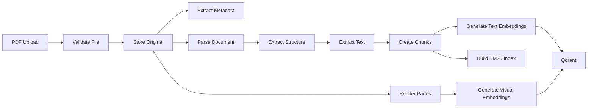
```mermaid
flowchart LR

    PDF["PDF Upload"]

    VALIDATE["Validate File"]

    STORE["Store Original"]

    META["Extract Metadata"]

    PARSE["Parse Document"]

    STRUCT["Extract Structure"]

    TEXT["Extract Text"]

    CHUNK["Create Chunks"]

    RENDER["Render Pages"]

    TEXT_EMBED["Generate Text Embeddings"]

    VIS_EMBED["Generate Visual Embeddings"]

    BM25_INDEX["Build BM25 Index"]

    VECTOR["Qdrant"]

    PDF --> VALIDATE
    VALIDATE --> STORE

    STORE --> META
    STORE --> PARSE
    STORE --> RENDER

    PARSE --> STRUCT
    STRUCT --> TEXT
    TEXT --> CHUNK

    CHUNK --> TEXT_EMBED
    CHUNK --> BM25_INDEX

    RENDER --> VIS_EMBED

    TEXT_EMBED --> VECTOR
    VIS_EMBED --> VECTOR
```

## Processing objectives

The ingestion system should preserve:

* document ID,
* page number,
* text,
* chunk ID,
* page image,
* document metadata,
* extraction metadata.

This allows retrieved evidence to be traced back to its source page.

---

# 5. Retrieval Architecture

DocuLens AI uses multiple retrieval strategies because different retrieval methods solve different problems.

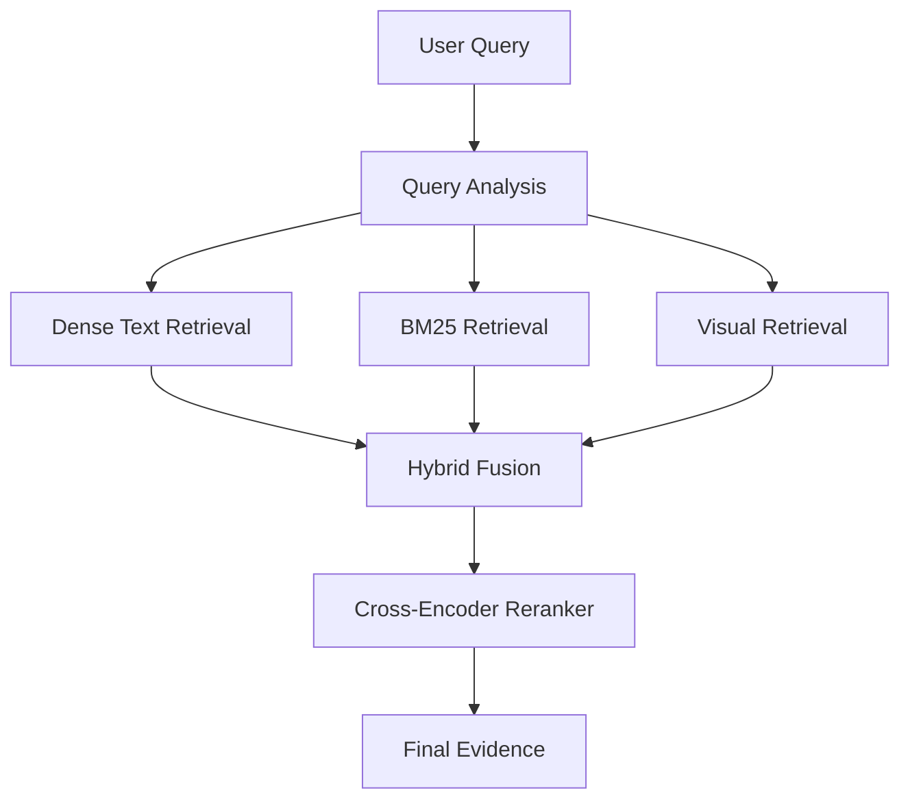
```mermaid
flowchart TB

    QUERY["User Query"]

    ANALYZER["Query Analysis"]

    DENSE["Dense Text Retrieval"]

    SPARSE["BM25 Retrieval"]

    VISUAL["Visual Retrieval"]

    FUSION["Hybrid Fusion"]

    RERANK["Cross-Encoder Reranker"]

    EVIDENCE["Final Evidence"]

    QUERY --> ANALYZER

    ANALYZER --> DENSE
    ANALYZER --> SPARSE
    ANALYZER --> VISUAL

    DENSE --> FUSION
    SPARSE --> FUSION
    VISUAL --> FUSION

    FUSION --> RERANK

    RERANK --> EVIDENCE
```

---

## 5.1 Dense Retrieval

Dense retrieval uses neural embeddings to identify semantically related content.

Example:

```text
Query:
"What methodology did the researchers use?"

Potential evidence:
"Our experimental methodology consisted of..."
```

The wording differs, but the semantic meaning is similar.

Dense retrieval is therefore useful for conceptual and semantic questions.

---

## 5.2 Sparse Retrieval — BM25

BM25 provides lexical retrieval.

It is particularly useful for:

* exact terminology,
* model names,
* dataset names,
* technical identifiers,
* acronyms,
* numbers,
* domain-specific terms.

Example:

```text
Query:
"What BLEU score did the model achieve?"

Important term:
BLEU
```

Dense and sparse retrieval therefore complement each other.

---

## 5.3 Visual Retrieval

Visual retrieval operates on page-level visual representations.

It is particularly useful when relevant information depends on:

* tables,
* figures,
* charts,
* page layout,
* scanned content,
* visually structured information.

The reference architecture recommends page-level visual retrieval for layout-heavy and scanned documents.

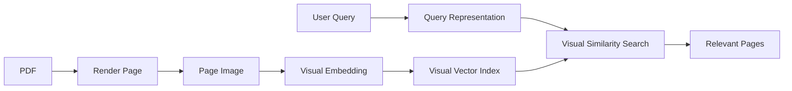
```mermaid
flowchart LR

    PDF["PDF"]

    RENDER["Render Page"]

    PAGE["Page Image"]

    VIS_EMBED["Visual Embedding"]

    INDEX["Visual Vector Index"]

    QUERY["User Query"]

    Q_EMBED["Query Representation"]

    SEARCH["Visual Similarity Search"]

    RESULTS["Relevant Pages"]

    PDF --> RENDER
    RENDER --> PAGE
    PAGE --> VIS_EMBED
    VIS_EMBED --> INDEX

    QUERY --> Q_EMBED
    Q_EMBED --> SEARCH
    INDEX --> SEARCH
    SEARCH --> RESULTS
```

---

# 6. Hybrid Retrieval and Fusion

No single retrieval mechanism should be assumed to work best for every query.

DocuLens combines:

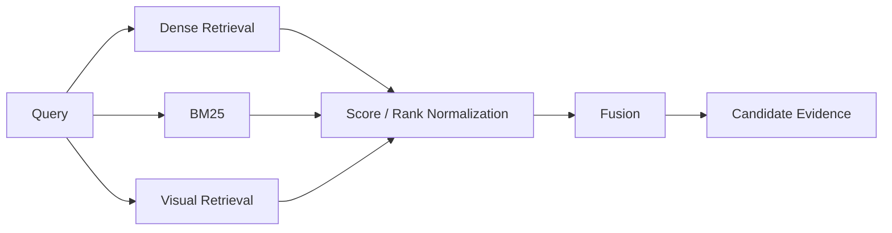
```mermaid
flowchart LR

    QUERY["Query"]

    DENSE["Dense Retrieval"]
    BM25["BM25"]
    VISUAL["Visual Retrieval"]

    NORMALIZE["Score / Rank Normalization"]

    FUSION["Fusion"]

    CANDIDATES["Candidate Evidence"]

    QUERY --> DENSE
    QUERY --> BM25
    QUERY --> VISUAL

    DENSE --> NORMALIZE
    BM25 --> NORMALIZE
    VISUAL --> NORMALIZE

    NORMALIZE --> FUSION

    FUSION --> CANDIDATES
```

Initial fusion strategies:

* **Weighted Linear Fusion**:
  $$\text{fused\_score}(d) = w_{\text{dense}} \cdot s_{\text{norm, dense}}(d) + w_{\text{bm25}} \cdot s_{\text{norm, bm25}}(d) + w_{\text{visual}} \cdot s_{\text{norm, visual}}(d)$$
  * Initial defaults: $w_{\text{dense}}=0.5, w_{\text{bm25}}=0.3, w_{\text{visual}}=0.2$ (normalized so $\sum w = 1.0$).
* **Reciprocal Rank Fusion (RRF)**:
  $$\text{RRF\_score}(d) = \sum_{m \in \text{sources}(d)} \frac{1}{k + \text{rank}_m(d)}$$
  * Initial default: $k=60$ ($k \ge 1$).

### Rationale & Limitations

- **Why Hybrid Retrieval**: Dense embeddings excel at semantic paraphrasing, BM25 captures exact technical identifiers and symbols, and Visual retrieval finds graphical/tabular page layouts. Combining them creates a comprehensive candidate pool.
- **Score Normalization Requirement**: Raw scores operate on incompatible scales (cosine similarity $[-1, 1]$ vs unbounded positive BM25 scores). Direct addition is statistically invalid; min-max normalization or rank-based RRF must be used.
- **Parameter Status**: Current defaults ($w=\{0.5, 0.3, 0.2\}, k=60$) represent standard baseline starting points, not empirically proven optima for all document distributions. Formal parameter sweeps and evaluation are deferred to Phase 4.6 and Phase 6.

---

# 7. Reranking and Grounding

Retrieval produces candidate evidence.

Reranking determines which candidates are most relevant.

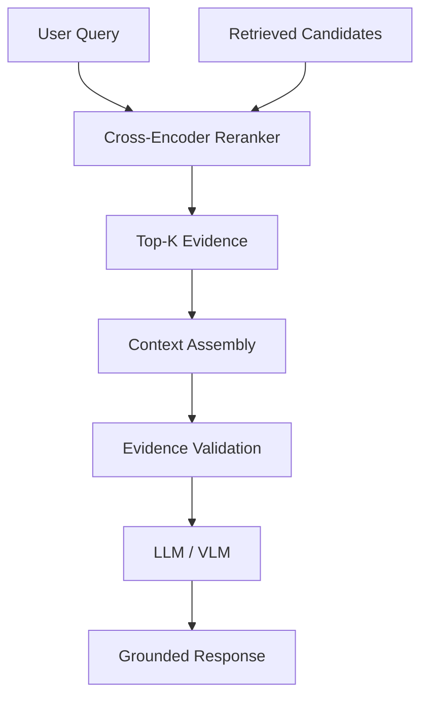
```mermaid
flowchart TB

    QUERY["User Query"]

    CANDIDATES["Retrieved Candidates"]

    RERANK["Cross-Encoder Reranker"]

    TOPK["Top-K Evidence"]

    CONTEXT["Context Assembly"]

    VALIDATE["Evidence Validation"]

    GENERATE["LLM / VLM"]

    RESPONSE["Grounded Response"]

    QUERY --> RERANK
    CANDIDATES --> RERANK

    RERANK --> TOPK

    TOPK --> CONTEXT
    CONTEXT --> VALIDATE

    VALIDATE --> GENERATE

    GENERATE --> RESPONSE
```

The objective is to avoid passing a large amount of weak evidence into the generation model.

Conceptually:

```text
100 candidates
      ↓
fusion
      ↓
20 candidates
      ↓
reranking
      ↓
5 strong candidates
      ↓
grounded generation
```

---

# 8. Agent Architecture (Planned / Future Roadmap — Phase 11)

> **Current Implementation Note:** DocuLens AI currently uses **deterministic pipeline orchestration** (retrieval -> RRF fusion -> cross-encoder reranker -> N-gram citation validation -> constrained LLM generation). Autonomous agentic planning and dynamic tool invocation are planned for **Phase 11** and will be introduced only where experimentally proven to outperform deterministic RAG.

When introduced, agents will be used selectively and with strict boundaries for orchestration:

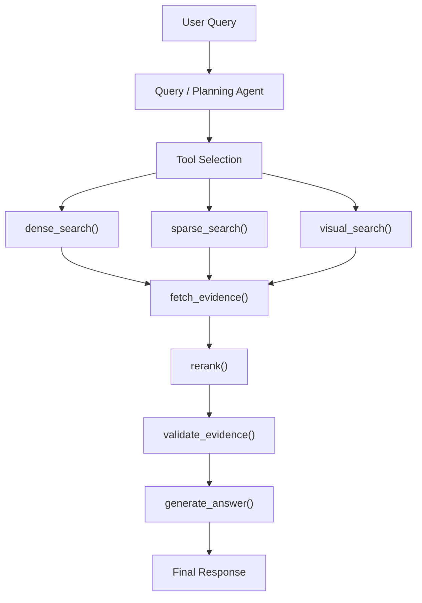
```mermaid
flowchart TB

    USER_QUERY["User Query"]

    PLANNER["Query / Planning Agent"]

    TOOL_ROUTER["Tool Selection"]

    DENSE["dense_search()"]

    BM25["sparse_search()"]

    VISUAL["visual_search()"]

    FETCH["fetch_evidence()"]

    RERANK["rerank()"]

    VALIDATE["validate_evidence()"]

    ANSWER["generate_answer()"]

    RESPONSE["Final Response"]

    USER_QUERY --> PLANNER

    PLANNER --> TOOL_ROUTER

    TOOL_ROUTER --> DENSE
    TOOL_ROUTER --> BM25
    TOOL_ROUTER --> VISUAL

    DENSE --> FETCH
    BM25 --> FETCH
    VISUAL --> FETCH

    FETCH --> RERANK
    RERANK --> VALIDATE

    VALIDATE --> ANSWER
    ANSWER --> RESPONSE
```

## Agent boundaries

The agent should have access only to explicitly defined tools.

Example:

```text
dense_search(query, document_ids, top_k)

sparse_search(query, document_ids, top_k)

visual_search(query, document_ids, top_k)

fetch_evidence(document_id, page_number)

rerank(query, candidates)

validate_evidence(evidence)
```

The agent should not have unrestricted access to:

* databases,
* filesystem commands,
* shell execution,
* arbitrary HTTP requests,
* credentials,
* internal infrastructure.

This makes the system's agentic behavior bounded, testable, and observable.

---

# 9. Generation Architecture

The generation layer receives:

```text
User Question
+
Retrieved Evidence
+
Document Metadata
+
Page Information
```

and produces a structured grounded response.

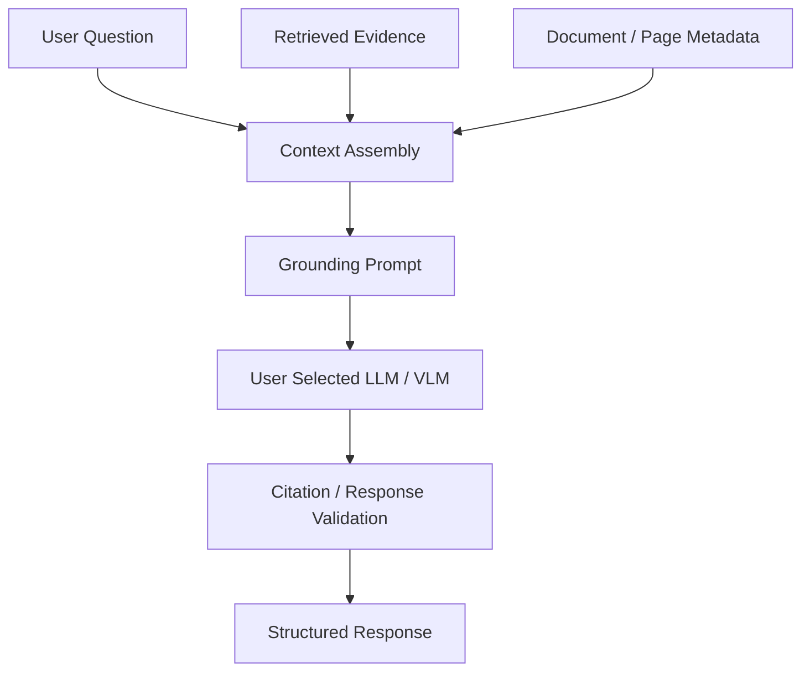
```mermaid
flowchart TB

    QUESTION["User Question"]

    EVIDENCE["Retrieved Evidence"]

    METADATA["Document / Page Metadata"]

    CONTEXT["Context Assembly"]

    PROMPT["Grounding Prompt"]

    MODEL["User Selected LLM / VLM"]

    VALIDATE["Citation / Response Validation"]

    RESPONSE["Structured Response"]

    QUESTION --> CONTEXT
    EVIDENCE --> CONTEXT
    METADATA --> CONTEXT

    CONTEXT --> PROMPT
    PROMPT --> MODEL

    MODEL --> VALIDATE
    VALIDATE --> RESPONSE
```

Target response:

```json
{
  "answer": "The authors evaluated...",
  "citations": [
    {
      "document_id": "doc_123",
      "page": 7,
      "evidence_text": "..."
    }
  ]
}
```

If sufficient evidence cannot be found, the system should prefer an explicit limitation response rather than unsupported generation.

---

# 10. BYOK Architecture

DocuLens AI follows a **Bring Your Own Key** model for external AI inference.

Users provide their own provider credentials.

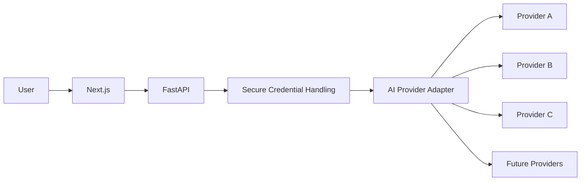
```mermaid
flowchart LR

    USER["User"]

    FRONTEND["Next.js"]

    API["FastAPI"]

    CREDENTIAL["Secure Credential Handling"]

    ADAPTER["AI Provider Adapter"]

    OPENAI["Provider A"]
    ANTHROPIC["Provider B"]
    GOOGLE["Provider C"]
    FUTURE["Future Providers"]

    USER --> FRONTEND

    FRONTEND --> API

    API --> CREDENTIAL
    CREDENTIAL --> ADAPTER

    ADAPTER --> OPENAI
    ADAPTER --> ANTHROPIC
    ADAPTER --> GOOGLE
    ADAPTER --> FUTURE
```

## Provider abstraction

The application should use a provider interface rather than coupling business logic to one vendor.

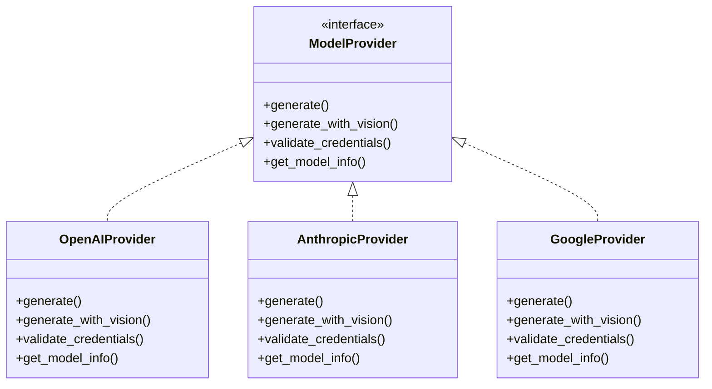
```mermaid
classDiagram

    class ModelProvider {
        <<interface>>
        +generate()
        +generate_with_vision()
        +validate_credentials()
        +get_model_info()
    }

    class OpenAIProvider {
        +generate()
        +generate_with_vision()
        +validate_credentials()
        +get_model_info()
    }

    class AnthropicProvider {
        +generate()
        +generate_with_vision()
        +validate_credentials()
        +get_model_info()
    }

    class GoogleProvider {
        +generate()
        +generate_with_vision()
        +validate_credentials()
        +get_model_info()
    }

    ModelProvider <|.. OpenAIProvider
    ModelProvider <|.. AnthropicProvider
    ModelProvider <|.. GoogleProvider
```

The exact supported providers will be determined during implementation based on the selected SDKs/models and their current capabilities.

---

# 11. Storage Architecture

## 11.1 Current Implemented Storage (Local-First)

DocuLens AI implements a lightweight, local-first storage architecture that runs entirely self-contained without requiring external database servers:

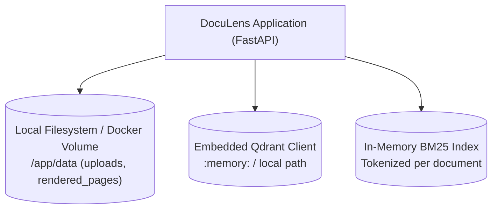
```mermaid
flowchart TB

    APP["DocuLens Application (FastAPI)"]

    FILESTORE[("Local Filesystem / Docker Volume\n/app/data (uploads, rendered_pages)")]
    QDRANT[("Embedded Qdrant Client\n:memory: / local path")]
    BM25[("In-Memory BM25 Index\nTokenized per document")]

    APP --> FILESTORE
    APP --> QDRANT
    APP --> BM25
```

### Document Filesystem Storage
* **Original PDFs**: Stored under `data/uploads/{document_id}.pdf` with filename, MIME type, and size validation.
* **Rendered Pages**: Stored under `data/rendered_pages/{document_id}/page_{n}.png` rendered at 150 DPI for visual evidence display.
* **Persistence**: In Docker environments, `/app/data` is mounted to the named volume `doculens_data`.

### Embedded Vector Store (Qdrant)
* **Mode**: Embedded in-process client (`QDRANT_LOCATION=":memory:"` by default for zero external dependencies and fast startup; configurable to `QDRANT_PATH` for persistent disk storage).
* **Text Chunk Collection**: `document_chunks` (384-dimensional dense vectors using `BAAI/bge-small-en-v1.5`, Cosine distance).
* **Visual Page Collection**: `visual_pages` (512-dimensional visual vectors using `Qdrant/clip-ViT-B-32-vision`, Cosine distance).
* **Isolation**: All queries enforce strict filtering by `document_id`.

### Lexical Search Index (BM25)
* **Mode**: In-memory tokenized BM25Okapi index per document, enabling zero-infrastructure lexical search alongside dense vectors.

---

## 11.2 Future Planned Storage (Scale-Out Architecture)

When scaling beyond a single host or adding multi-user organization accounts:

* **PostgreSQL**: Planned relational metadata database for user accounts, workspace memberships, and audit logs.
* **External Qdrant Cluster**: Planned distributed vector database when collection sizes exceed host memory/disk limits.
* **Cloud Object Storage (S3 / MinIO / GCS)**: Planned blob storage adapter for distributed document and page image hosting.

---

# 12. Data Model

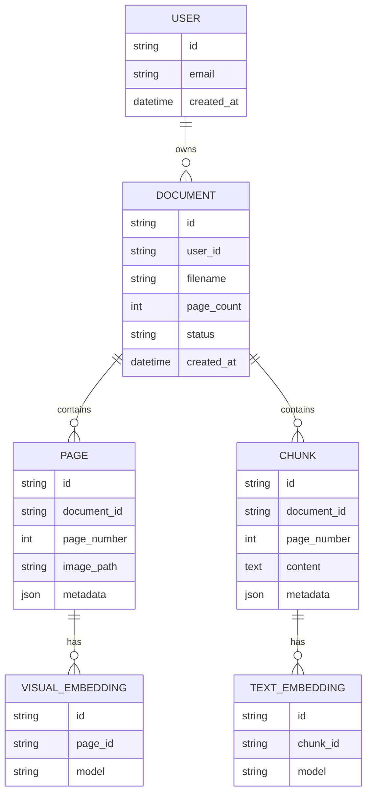
```mermaid
erDiagram

    USER ||--o{ DOCUMENT : owns

    DOCUMENT ||--o{ PAGE : contains

    DOCUMENT ||--o{ CHUNK : contains

    PAGE ||--o{ VISUAL_EMBEDDING : has

    CHUNK ||--o{ TEXT_EMBEDDING : has

    DOCUMENT {
        string id
        string user_id
        string filename
        int page_count
        string status
        datetime created_at
    }

    PAGE {
        string id
        string document_id
        int page_number
        string image_path
        json metadata
    }

    CHUNK {
        string id
        string document_id
        int page_number
        text content
        json metadata
    }

    TEXT_EMBEDDING {
        string id
        string chunk_id
        string model
    }

    VISUAL_EMBEDDING {
        string id
        string page_id
        string model
    }

    USER {
        string id
        string email
        datetime created_at
    }
```

The key design principle is **traceability**:

```text
Embedding
   ↓
Chunk / Page
   ↓
Document (Isolated by document_id)
   ↓
[Future: User / Tenant]
```

*(Note: The current implementation isolates chunks, pages, and embeddings strictly by `document_id`. The `USER` entity and relation are defined for the planned Phase 10 multi-user authentication layer.)*

---

# 13. Security Architecture

Security is particularly important because the system handles uploaded documents and external AI provider credentials.

## 13.1 Implemented Security Controls

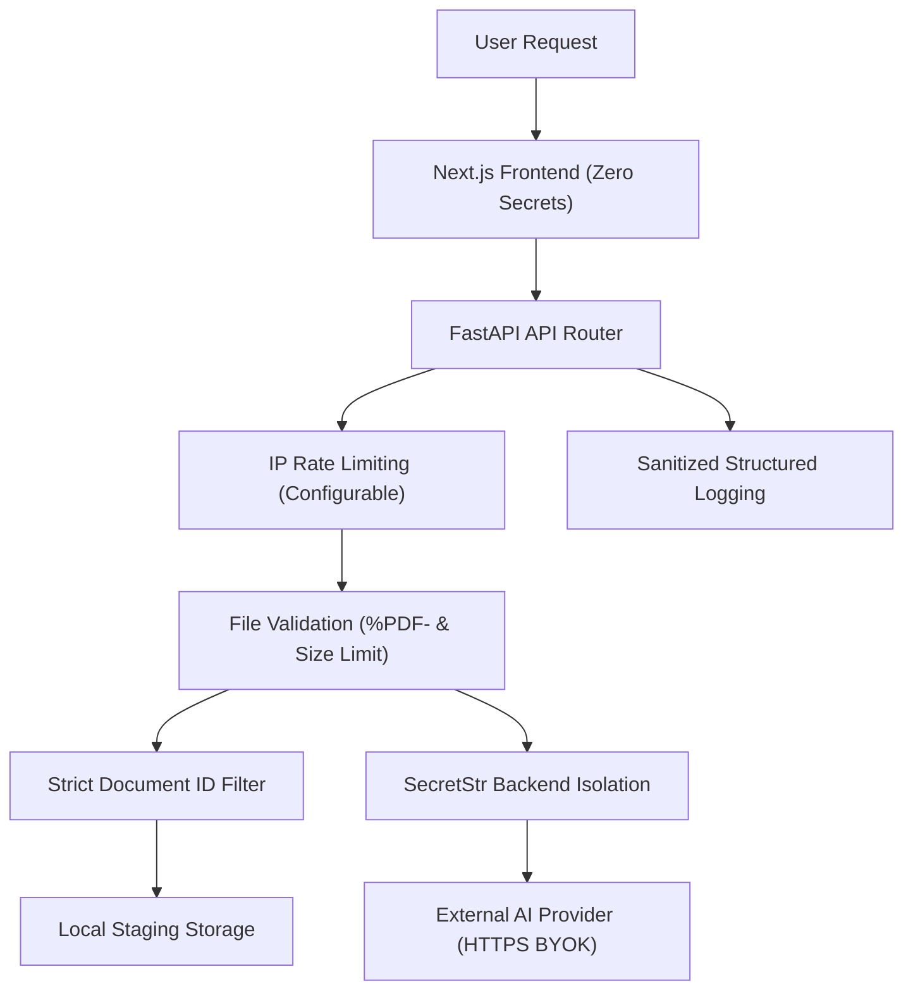
```mermaid
flowchart TB

    USER["User Request"]

    FRONTEND["Next.js Frontend (Zero Secrets)"]

    API["FastAPI API Router"]

    RATE_LIMIT["IP Rate Limiting (Configurable)"]

    VALIDATION["File Validation (%PDF- & Size Limit)"]

    SECRETS["SecretStr Backend Isolation"]

    ISOLATION["Strict Document ID Filter"]

    LOGGING["Sanitized Structured Logging"]

    PROVIDER["External AI Provider (HTTPS BYOK)"]

    STORAGE["Local Staging Storage"]

    USER --> FRONTEND
    FRONTEND --> API

    API --> RATE_LIMIT
    RATE_LIMIT --> VALIDATION

    VALIDATION --> ISOLATION
    VALIDATION --> SECRETS

    ISOLATION --> STORAGE
    SECRETS --> PROVIDER

    API --> LOGGING
```

* **Client-Side Secret Isolation**: Third-party API keys (e.g. `GEMINI_API_KEY`, `LLM_API_KEY`) and internal configuration (`QDRANT_LOCATION`) are never bundled, transmitted, or accessible in frontend client code.
* **Upload Security**: Only PDF documents with valid `%PDF-` magic bytes are processed. Content-Type and strict 10 MB size limits are enforced at the HTTP boundary.
* **Document Isolation**: Vector store and BM25 searches require a non-empty `document_id` filter to prevent cross-document data leakage.
* **Safe Error Handling**: Internal stack traces, database locations, and filesystem paths are suppressed from client responses.

## 13.2 Planned Security Controls (Phase 10 Roadmap)

* **User Authentication & Authorization**: OAuth2 / JWT user login and role-based access control (RBAC).
* **Multi-Tenant Organization Workspaces**: Cryptographic user/workspace isolation across shared infrastructure.
* **KMS / Hardware Encryption**: Enterprise key-management service encryption at rest for cloud deployments.

---

# 14. Observability Architecture

The system should record enough information to understand performance and failures.

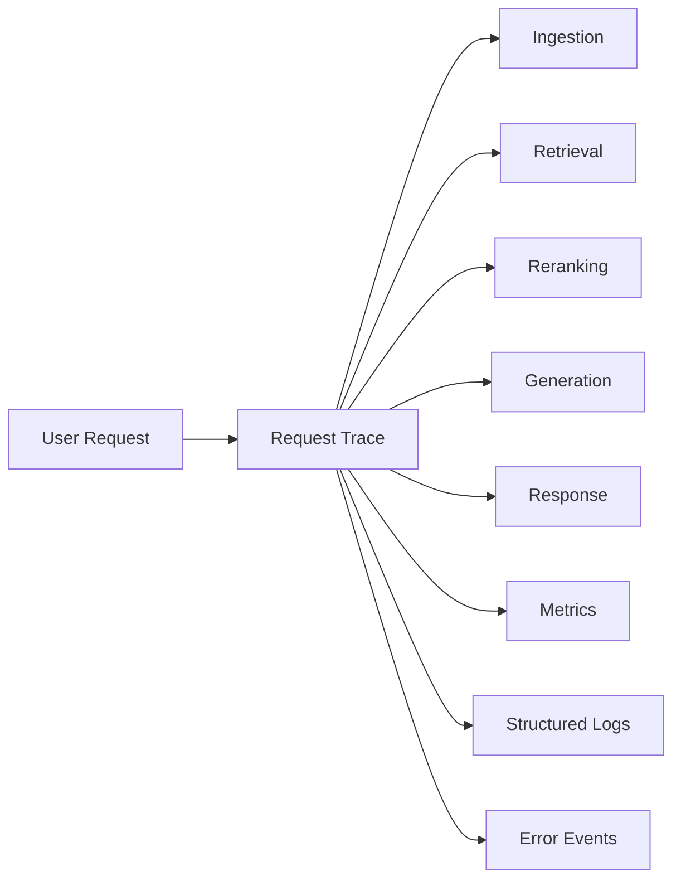
```mermaid
flowchart LR

    REQUEST["User Request"]

    TRACE["Request Trace"]

    INGEST["Ingestion"]

    RETRIEVAL["Retrieval"]

    RERANK["Reranking"]

    GENERATION["Generation"]

    RESPONSE["Response"]

    METRICS["Metrics"]

    LOGS["Structured Logs"]

    ERRORS["Error Events"]

    REQUEST --> TRACE

    TRACE --> INGEST
    TRACE --> RETRIEVAL
    TRACE --> RERANK
    TRACE --> GENERATION
    TRACE --> RESPONSE

    TRACE --> METRICS
    TRACE --> LOGS
    TRACE --> ERRORS
```

Important measurements:

```text
ingestion latency
page count
chunk count
retrieval latency
dense retrieval count
BM25 retrieval count
visual retrieval count
reranking latency
generation latency
token usage
model/provider
failure type
```

Example trace:

```text
Query ID: q_123

Query analysis:       80 ms
Dense retrieval:     120 ms
BM25 retrieval:       35 ms
Visual retrieval:    410 ms
Fusion:                 5 ms
Reranking:            180 ms
Generation:          1520 ms

Total:               2350 ms
```

The reference specifically identifies ingestion, retrieval, generation latency and failure logging as important production considerations.

---

# 15. Deployment Architecture

DocuLens AI provides reproducible deployment workflows via **Docker Compose** as well as local bare-metal configurations.

## 15.1 Current Implemented Deployment (Self-Contained Docker Compose)

The production stack consists of two minimal, self-contained containers with zero external database dependencies:

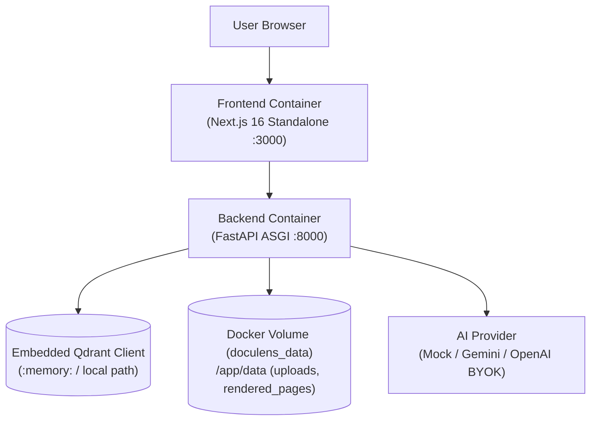
```mermaid
flowchart TB

    USER["User Browser"]

    FRONTEND["Frontend Container\n(Next.js 16 Standalone :3000)"]

    BACKEND["Backend Container\n(FastAPI ASGI :8000)"]

    EMBEDDED_QDRANT[("Embedded Qdrant Client\n(:memory: / local path)")]

    VOLUME[("Docker Volume (doculens_data)\n/app/data (uploads, rendered_pages)")]

    AI["AI Provider\n(Mock / Gemini / OpenAI BYOK)"]

    USER --> FRONTEND
    FRONTEND --> BACKEND

    BACKEND --> EMBEDDED_QDRANT
    BACKEND --> VOLUME
    BACKEND --> AI
```

### Container Topology
```text
Docker Compose (Implemented Stack)
├── frontend  # Next.js 16 standalone server on port 3000
└── backend   # FastAPI ASGI server on port 8000 (embedded Qdrant + volume /app/data)
```

* **Zero External Databases**: No PostgreSQL, standalone Qdrant, Redis, or Celery containers are required for standard deployment.
* **Persistent Workspace**: Uploaded PDFs and rendered page images are stored in the Docker volume (`doculens_data`) mounted to `/app/data`.
* **Resource Budget**: Operates within <=6 GB RAM and <=25 GB disk footprints (Codespaces-compatible).

## 15.2 Planned Future Scale-Out Options

If enterprise workloads require multi-node scaling:
* **Standalone Qdrant Cluster**: Run dedicated Qdrant nodes for massive document collections.
* **PostgreSQL Service**: Dedicated relational container for multi-tenant accounts and search histories.
* **Asynchronous Background Workers**: Redis / Celery task queues for distributed batch extraction.

---

# 16. End-to-End Workflow

## 16.1 Document ingestion workflow

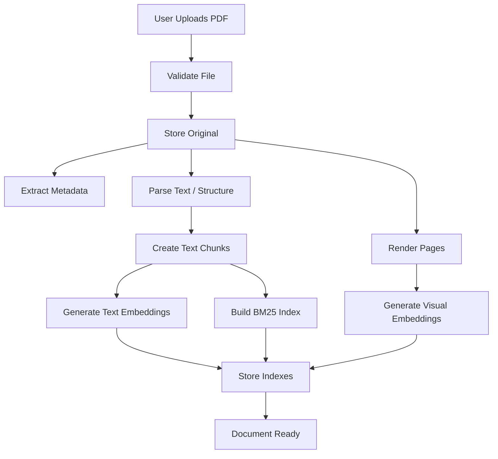
```mermaid
flowchart TD

    A["User Uploads PDF"]

    B["Validate File"]

    C["Store Original"]

    D["Extract Metadata"]

    E["Parse Text / Structure"]

    F["Render Pages"]

    G["Create Text Chunks"]

    H["Generate Text Embeddings"]

    I["Generate Visual Embeddings"]

    J["Build BM25 Index"]

    K["Store Indexes"]

    L["Document Ready"]

    A --> B
    B --> C

    C --> D
    C --> E
    C --> F

    E --> G
    G --> H
    G --> J

    F --> I

    H --> K
    I --> K
    J --> K

    K --> L
```

---

## 16.2 Query workflow

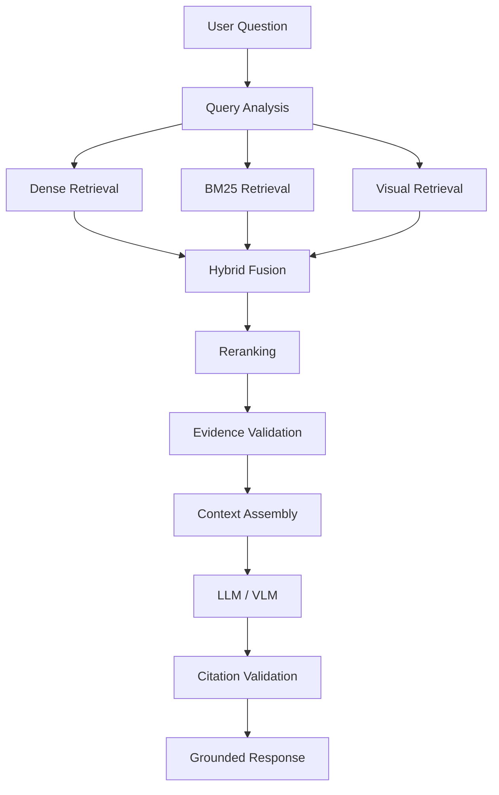
```mermaid
flowchart TD

    A["User Question"]

    B["Query Analysis"]

    C["Dense Retrieval"]

    D["BM25 Retrieval"]

    E["Visual Retrieval"]

    F["Hybrid Fusion"]

    G["Reranking"]

    H["Evidence Validation"]

    I["Context Assembly"]

    J["LLM / VLM"]

    K["Citation Validation"]

    L["Grounded Response"]

    A --> B

    B --> C
    B --> D
    B --> E

    C --> F
    D --> F
    E --> F

    F --> G
    G --> H

    H --> I
    I --> J

    J --> K
    K --> L
```

---

# 17. Architecture Evolution

DocuLens AI will evolve incrementally rather than starting with the complete advanced architecture.

```mermaid
flowchart LR

    MVP["MVP<br/>Text RAG"]

    V1["V1<br/>Multimodal Retrieval"]

    AGENT["Agentic<br/>Orchestration"]

    EVAL["Evaluation<br/>& Experiments"]

    PRODUCT["Full Product<br/>Frontend + BYOK"]

    PROD["Production-Oriented<br/>Security + Observability"]

    SCALE["Advanced<br/>Cloud / Scaling"]

    MVP --> V1
    V1 --> AGENT
    AGENT --> EVAL
    EVAL --> PRODUCT
    PRODUCT --> PROD
    PROD --> SCALE
```

## 17.1 MVP

```mermaid
flowchart LR

    PDF["PDF"]

    TEXT["Text Extraction"]

    CHUNK["Chunking"]

    EMBED["Dense Embeddings"]

    VECTOR["Vector Search"]

    LLM["LLM"]

    ANSWER["Answer + Citation"]

    PDF --> TEXT
    TEXT --> CHUNK
    CHUNK --> EMBED
    EMBED --> VECTOR

    VECTOR --> LLM
    LLM --> ANSWER
```

### MVP objectives

* prove document ingestion,
* prove retrieval,
* prove generation,
* establish baseline metrics,
* preserve page-level metadata.

---

## 17.2 Current Implementation — V1 Multimodal Hybrid RAG

This represents the operational baseline currently implemented in DocuLens AI:

```mermaid
flowchart TB

    PDF["PDF Document"]

    TEXT["PyPDF Text Chunks"]

    PAGES["PyMuPDF Rendered Pages"]

    DENSE["Dense Vector Search (FastEmbed)"]

    BM25["BM25Okapi Lexical Search"]

    VISUAL["Visual Page Search (CLIP)"]

    FUSION["Reciprocal Rank Fusion (k=60)"]

    RERANK["Cross-Encoder Reranker"]

    GENERATE["Grounded LLM Generator"]

    RESPONSE["Answer + Verified Page Citations"]

    PDF --> TEXT
    PDF --> PAGES

    TEXT --> DENSE
    TEXT --> BM25
    PAGES --> VISUAL

    DENSE --> FUSION
    BM25 --> FUSION
    VISUAL --> FUSION

    FUSION --> RERANK
    RERANK --> GENERATE

    GENERATE --> RESPONSE
```

---

## 17.3 Planned Future Phase — Bounded Agentic Layer (Phase 11)

> **Status:** Planned / Future Roadmap. Autonomous agents will be introduced only after deterministic hybrid pipelines are benchmarked.

```mermaid
flowchart TB

    QUERY["User Query"]

    AGENT["Bounded Query Agent"]

    TOOLS["Approved Retrieval Tools"]

    RETRIEVAL["Retrieval System"]

    VALIDATOR["Evidence Validator"]

    GENERATOR["Answer Generator"]

    RESPONSE["Grounded Response"]

    QUERY --> AGENT
    AGENT --> TOOLS
    TOOLS --> RETRIEVAL
    RETRIEVAL --> VALIDATOR

    VALIDATOR --> GENERATOR
    GENERATOR --> RESPONSE
```

Agents are introduced only after the underlying retrieval capabilities exist and can be tested independently.

---

## 17.4 Planned Future Phase — Scaled Enterprise & Cloud Architecture (Phase 12+)

> **Status:** Planned / Future Roadmap for multi-user organization deployment. Not required for current local-first deployment.

```mermaid
flowchart TB

    USER["User"]

    subgraph PRODUCT["DocuLens AI"]

        FRONTEND["Next.js Frontend"]

        API["FastAPI"]

        AUTH["Authentication"]

        DOCS["Document Service"]

        ORCH["Agent Orchestrator"]

        RET["Hybrid Retrieval"]

        RERANK["Reranker"]

        GROUND["Grounding"]

        PROVIDER["Provider Adapter"]

    end

    subgraph DATA["Data Layer"]

        POSTGRES[("PostgreSQL")]

        QDRANT[("Qdrant")]

        OBJECT[("Object Storage")]

    end

    subgraph AI["User AI Provider"]

        LLM["LLM"]

        VLM["VLM"]

    end

    USER --> FRONTEND
    FRONTEND --> API

    API --> AUTH
    API --> DOCS
    API --> ORCH

    DOCS --> POSTGRES
    DOCS --> OBJECT

    ORCH --> RET
    RET --> QDRANT
    RET --> RERANK

    RERANK --> GROUND
    GROUND --> PROVIDER

    PROVIDER --> LLM
    PROVIDER --> VLM

    GROUND --> API
    API --> FRONTEND
```

---

## Architecture Evolution Principle

The architecture follows this progression:

```mermaid
flowchart LR

    SIMPLE["Simple"]

    BASELINE["Text Retrieval"]

    MULTI["Multimodal Retrieval"]

    HYBRID["Hybrid + Reranking"]

    AGENTIC["Bounded Agents"]

    EVALUATED["Measured System"]

    SECURE["Secure Product"]

    OBSERVED["Observable System"]

    DEPLOYED["Deployable System"]

    SIMPLE --> BASELINE
    BASELINE --> MULTI
    MULTI --> HYBRID
    HYBRID --> AGENTIC
    AGENTIC --> EVALUATED
    EVALUATED --> SECURE
    SECURE --> OBSERVED
    OBSERVED --> DEPLOYED
```

Each architectural expansion should be justified by one or more of:

* a demonstrated retrieval limitation,
* an evaluation result,
* a product requirement,
* a reliability requirement,
* a security requirement,
* a performance requirement,
* or a deployment requirement.

The project should not introduce infrastructure simply to make the architecture diagram appear more complex.

---

# Architectural Principles

## Principle 1 — Baseline First

The text-only retrieval system is the experimental baseline.

Every major retrieval improvement should be compared against it.

## Principle 2 — Evidence Before Generation

The generation model should receive retrieved evidence rather than being expected to independently search the entire document corpus.

## Principle 3 — Multimodality Where It Adds Value

Visual retrieval exists to solve document problems that text-only retrieval cannot reliably solve.

## Principle 4 — Bounded Agents

Agents receive explicit tools and constrained responsibilities.

Deterministic operations remain deterministic where practical.

## Principle 5 — Provider Independence

External model inference should use a provider abstraction so that the application is not tightly coupled to a single model vendor.

## Principle 6 — BYOK

Users provide their own external AI provider credentials.

Project-owned API credentials are not used to provide unrestricted inference to end users.

## Principle 7 — Traceability

Retrieved evidence must preserve document and page identity so that answers can be grounded and inspected.

## Principle 8 — Measured Improvement

No architectural component should be considered an improvement until experiments demonstrate its effect.

## Principle 9 — Incremental Complexity

Start with a working system and introduce complexity only when the system requires it.

## Principle 10 — Honest Claims

The project will distinguish between:

* planned capabilities,
* implemented capabilities,
* measured results,
* and future work.

No performance, scale, accuracy, or production-readiness claim should be made without supporting evidence.
