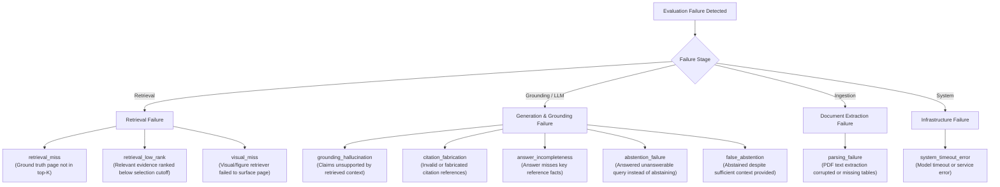

# DocuLens AI — Evaluation Framework & Gold Dataset Design

> **Phase 6.1 Design Document**  
> Multimodal Document Intelligence Evaluation Framework, Metrics, Failure Taxonomy, and Gold Dataset Specification.

---

# 1. Evaluation Overview & Goals

## 1.1 Core Engineering Hypotheses

DocuLens AI is evaluated to scientifically validate whether architectural components deliver measurable improvements over simpler baselines:

1. **Multimodal Retrieval Hypothesis**: Incorporating page-level visual embeddings alongside text and BM25 improves retrieval recall and question answering quality on visually and tabularly structured PDFs compared to a text-only retrieval baseline.
2. **Reranking & Selection Hypothesis**: Cross-encoder reranking and deterministic evidence selection increase context precision, ensuring top evidence items contain the essential information needed to answer the query.
3. **Grounding & Citation Hypothesis**: Constrained generation paired with deterministic citation validation eliminates hallucinated source citations and ensures all claims are traceable to specific document pages.

## 1.2 Evaluation Principles

- **Separation of Concerns**: Retrieval quality and generation quality are evaluated at decoupled boundaries to isolate root causes.
- **Component-Level Debugging**: Failures are classified into explicit taxonomical categories (e.g. retrieval miss vs parsing corruption vs hallucination) rather than treating the system as a single black box.
- **Experimental Baselines**: Every advanced configuration is measured against a text-only baseline using identical gold benchmark queries.
- **Honest Claims & Traceability**: Planned thresholds are clearly distinguished from empirically measured experiment results. No evaluation metrics or results are fabricated.

---

# 2. Evaluation Boundaries

To pinpoint performance bottlenecks, the system is divided into three distinct evaluation boundaries:

```mermaid
flowchart TB
    subgraph RETRIEVAL_BOUNDARY["1. Retrieval Boundary (No LLM)"]
        Q1["User Query"] --> RET["Retriever / Hybrid Fusion / Reranker"]
        DOCS["Document Corpus"] --> RET
        RET --> RET_OUT["Retrieved / Reranked Candidates (Pages, Chunks, Scores)"]
    end

    subgraph GENERATION_BOUNDARY["2. Generation Boundary (Isolated from Retrieval)"]
        Q2["Query"] --> GEN["Grounded Generator / LLM"]
        PERFECT_CTX["Ground-Truth or Fixed Evidence Context"] --> GEN
        GEN --> GEN_OUT["Generated Answer + Citations"]
    end

    subgraph E2E_BOUNDARY["3. End-to-End Pipeline Boundary"]
        Q3["Query"] --> E2E_RET["Full Retrieval & Selection Pipeline"]
        E2E_RET --> E2E_CTX["Assembled Context"]
        E2E_CTX --> E2E_GEN["Grounded Generator"]
        E2E_GEN --> E2E_VAL["Citation Validator"]
        E2E_VAL --> E2E_OUT["Final Grounded Answer + Citations + Metadata"]
    end
```



### Boundary 1: Retrieval Boundary
- **Inputs**: User query string, target document collection.
- **Outputs**: Ordered list of candidate chunks and visual pages with ranks and relevance scores.
- **Focus**: Evaluates candidate recall, ranking quality, and modality contribution without confounding noise from LLM generation.
- **Primary Metrics**: Recall@k, MRR@k, Context Precision, Context Recall.

### Boundary 2: Generation Boundary
- **Inputs**: User query string, controlled evidence context (e.g., ground-truth evidence snippets or fixed candidate sets).
- **Outputs**: Generated text answer with citation tags and validated citations.
- **Focus**: Evaluates adherence to provided context, factual faithfulness, citation validity, and hallucination rate without penalty for upstream retrieval misses.
- **Primary Metrics**: Faithfulness, Answer Relevancy, Citation Precision, Citation Recall.

### Boundary 3: End-to-End Pipeline Boundary
- **Inputs**: User query string, document identifier.
- **Outputs**: Complete `GenerationResult` including final answer, validated citations, and execution latency.
- **Focus**: Measures holistic user experience, end-to-end task success, abstention correctness on unanswerable queries, and operational latency.
- **Primary Metrics**: End-to-End Answer Correctness, Abstention Accuracy, Total Latency, Token Usage.

---

# 3. Question Categories & Modality Taxonomy

The gold benchmark dataset categorizes queries across technical and multimodal reasoning dimensions:

| Category Identifier | Display Name | Description | Key Modalities |
|:---|:---|:---|:---|
| `factoid_text` | Factoid Text Lookup | Direct factual question where the answer is stated verbatim or near-verbatim in a single text passage. | Text (Dense / BM25) |
| `multi_page_reasoning` | Multi-Page Reasoning | Synthesis query requiring evidence aggregated across two or more distinct pages/sections. | Text (Dense / BM25) |
| `table_lookup` | Table & Tabular Data | Query requiring numeric, cell, or row/column lookup from a formatted table. | Text + Visual |
| `figure_chart_analysis` | Figure & Chart Analysis | Query requiring interpretation of graphical elements (plots, diagrams, trends, visual layouts). | Visual (Page Images) |
| `methodology_summary` | Methodology & Concept | Conceptual or architectural question summarizing workflows, algorithms, or system design. | Text + Visual |
| `negative_unanswerable` | Negative / Out-of-Domain | Query whose answer is NOT present in the document; tests explicit model abstention and refusal. | None (Abstention) |

### Expected Modality Classifiers
- `text`: Dense semantic embedding or BM25 keyword matching is sufficient.
- `visual`: Rendered page image analysis (e.g. diagrams, visual graphs) is strictly required.
- `hybrid`: Combining extracted text chunks and visual page context is necessary (e.g. complex tables, captioned figures).
- `table`: Tabular data structures where linear text chunking often loses row/column relationships.
- `figure`: Visual figures, plots, schematics, and workflows.

---

# 4. Gold Dataset Schema Specification

The Gold Dataset is stored as structured JSON and modeled via Pydantic (`app.schemas.evaluation.GoldDataset`).

## 4.1 Schema Overview

```json
{
  "dataset_id": "gold-benchmark-v1",
  "name": "DocuLens Research & Technical PDF Gold Benchmark",
  "version": "1.0.0",
  "description": "Curated benchmark for evaluating multimodal RAG over research papers and technical reports.",
  "created_at": "2026-09-11T00:00:00Z",
  "documents": [
    {
      "document_id": "doc-attention-2017",
      "document_title": "Attention Is All You Need",
      "file_name": "attention_is_all_you_need.pdf",
      "total_pages": 15,
      "domain": "machine_learning",
      "metadata": { "year": 2017, "arxiv": "1706.03762" }
    }
  ],
  "queries": [
    {
      "query_id": "q-001",
      "document_id": "doc-attention-2017",
      "question": "What is the computational complexity per layer of the Self-Attention mechanism compared to Recurrent layers in terms of sequence length n and representation dimension d?",
      "category": "table_lookup",
      "expected_sources": ["text", "table"],
      "ground_truth_pages": [6],
      "ground_truth_chunks": ["doc-attention-2017_p6_c2"],
      "ground_truth_evidence_text": "Table 1: Maximum path lengths, per-layer complexity and minimum number of sequential operations for different layer types. Self-Attention: O(n^2 * d) complexity per layer, O(1) sequential operations. Recurrent: O(n * d^2) complexity per layer, O(n) sequential operations.",
      "ground_truth_answer": "According to Table 1 on page 6, Self-Attention has a per-layer complexity of O(n^2 * d) with O(1) sequential operations, whereas Recurrent layers have a per-layer complexity of O(n * d^2) with O(n) sequential operations.",
      "key_reference_facts": [
        "Self-Attention complexity per layer is O(n^2 * d)",
        "Recurrent complexity per layer is O(n * d^2)",
        "Table 1 is located on page 6"
      ],
      "is_answerable": true,
      "difficulty": "medium",
      "metadata": { "section": "Table 1", "topic": "Complexity" }
    }
  ]
}
```

## 4.2 Gold Query Fields

| Field | Type | Description |
|:---|:---|:---|
| `query_id` | `str` | Unique deterministic identifier (e.g. `q-001`). |
| `document_id` | `str` | Foreign key referencing the parent document in `documents`. |
| `question` | `str` | Natural language question submitted to the pipeline. |
| `category` | `QuestionCategory` | Categorical taxonomy tag. |
| `expected_sources` | `list[ExpectedModality]` | Expected modality channels (`text`, `visual`, `hybrid`, `table`, `figure`). |
| `ground_truth_pages` | `list[int]` | 1-based page numbers containing the essential evidence. |
| `ground_truth_chunks` | `list[str]` | Optional chunk IDs containing the supporting text passages. |
| `ground_truth_evidence_text` | `str` | Verbatim or normalized reference text excerpt containing the evidence. |
| `ground_truth_answer` | `str` | Canonical reference answer used for generation evaluation. |
| `key_reference_facts` | `list[str]` | Atomic factual statements required in an accurate answer. |
| `is_answerable` | `bool` | True if document contains evidence; False for negative/abstention tests. |
| `difficulty` | `str` | Complexity rating: `easy`, `medium`, `hard`. |
| `metadata` | `dict[str, Any]` | Extensible metadata (section name, author notes, tags). |

---

# 5. Failure Taxonomy

Every evaluation failure is classified into a root-cause category to drive iterative engineering improvements:



### Taxonomy Definitions

| Failure Category | Description | Root Cause & Resolution |
|:---|:---|:---|
| `retrieval_miss` | Target ground-truth page was not retrieved in top-k candidate pool. | Ineffective query embedding, missing keywords in BM25, or inadequate modality weighting. |
| `retrieval_low_rank` | Ground-truth page was retrieved in top-K initial candidates but ranked below top-N evidence cutoff after reranking. | Cross-encoder reranker score penalty or improper score fusion. |
| `visual_miss` | Query required visual/layout evidence, but visual embeddings failed to rank the page in top candidates. | Visual embedder resolution limits or text-only query mismatch against visual features. |
| `parsing_failure` | PDF extraction truncated, garbled, or missed key textual/tabular content during ingestion. | PyMuPDF / structure extractor layout parser limitation. |
| `grounding_hallucination` | LLM generated factual claims not supported by the retrieved context. | Generator prompt leakage or LLM parametric knowledge intrusion. |
| `citation_fabrication` | Answer contains citations pointing to invalid evidence tags, incorrect documents, or invalid pages. | Generator formatting divergence; caught by `CitationValidator`. |
| `answer_incompleteness` | Answer is partially correct but omits essential key reference facts present in the evidence. | Context assembly truncation or insufficient generation token limit. |
| `abstention_failure` | System answered an unanswerable query (`is_answerable=False`) instead of explicitly abstaining. | Weak negative constraint prompting or hallucinated answer generation. |
| `false_abstention` | System returned an abstention response despite sufficient evidence present in retrieved context. | Overly aggressive evidence validator score threshold. |
| `system_timeout_error` | Request timed out, provider API threw 5xx, or service unreachable. | Rate limit, network error, or cold start latency. |

---

# 6. Planned Metrics & Mathematical Formulations

## 6.1 Retrieval Metrics

Let $Q$ be the set of queries, $G_q$ be the set of ground-truth pages for query $q$, and $R_{q, k}$ be the top-$k$ retrieved pages for query $q$.

### 1. Recall@k
Measures the proportion of relevant ground-truth pages found in the top-$k$ retrieved candidates:
$$\text{Recall@k} = \frac{1}{|Q|} \sum_{q \in Q} \frac{|G_q \cap R_{q, k}|}{|G_q|}$$

### 2. Mean Reciprocal Rank (MRR@k)
Measures the reciprocal rank of the first relevant page retrieved within top-$k$:
$$\text{MRR@k} = \frac{1}{|Q|} \sum_{q \in Q} \frac{1}{\text{rank}_q} \quad \text{where } \text{rank}_q = \min \{ i \le k \mid R_{q, k}[i] \in G_q \}, \text{ or } 0 \text{ if no hit}$$

### 3. Context Precision
Measures whether the highest-ranked retrieved chunks in the context are truly relevant to the query:
$$\text{Context Precision@k} = \frac{1}{|Q|} \sum_{q \in Q} \frac{\sum_{i=1}^k (\text{Precision@}i \times \mathbb{I}(R_{q, k}[i] \in G_q))}{|G_q \cap R_{q, k}|}$$

### 4. Context Recall
Measures the proportion of ground-truth reference facts that can be found within the retrieved context:
$$\text{Context Recall} = \frac{|\text{Ground Truth Facts Present in Context}|}{|\text{Total Ground Truth Facts}|}$$

## 6.2 Generation & Grounding Metrics

### 5. Faithfulness
Measures the factual consistency of the generated answer against the retrieved evidence context:
$$\text{Faithfulness} = \frac{|\text{Claims in Answer Entailed by Retrieved Context}|}{|\text{Total Claims in Generated Answer}|}$$
- A score of $1.0$ indicates zero ungrounded hallucinations.

### 6. Answer Relevancy
Measures how directly and completely the generated answer addresses the user's question:
$$\text{Answer Relevancy} = \text{CosineSimilarity}(\mathbf{e}_{\text{question}}, \mathbf{e}_{\text{generated\_question\_from\_answer}})$$

### 7. Citation Precision & Recall
- **Citation Precision**: Proportion of generated citations that match valid supporting evidence:
  $$\text{Citation Precision} = \frac{\text{Valid Citations}}{\text{Total Citations Generated}}$$
- **Citation Recall**: Proportion of required ground-truth pages that were correctly cited in the answer:
  $$\text{Citation Recall} = \frac{|G_q \cap \text{CitedPages}_q|}{|G_q|}$$

### 8. Abstention Accuracy
Measures whether the system appropriately abstains on unanswerable queries and answers answerable ones:
$$\text{Abstention Accuracy} = \frac{\text{Correct Abstentions} + \text{Correct Answers}}{|Q|}$$

## 6.3 Operational Metrics
- **Retrieval Latency ($t_{\text{ret}}$)**: Time spent executing dense, sparse, visual, and fusion searches (ms).
- **Reranking Latency ($t_{\text{rerank}}$)**: Time spent running cross-encoder scoring (ms).
- **Generation Latency ($t_{\text{gen}}$)**: Time spent waiting for LLM completion (ms).
- **Total Pipeline Latency ($t_{\text{total}}$)**: Wall-clock end-to-end request duration (ms).
- **Token Usage**: Prompt tokens, completion tokens, and total token count.

---

# 7. Experiment Configurations & Baselines

To prove the value of each architecture stage, experiments will evaluate the following configuration variants:

| Baseline / Variant ID | Description | Components Used |
|:---|:---|:---|
| `baseline_text_dense` | Text Baseline | Dense vector retrieval (FastEmbed BAAI/bge-small-en-v1.5) |
| `sparse_bm25` | Sparse Lexical Baseline | BM25 Okapi search over text chunks |
| `visual_only` | Visual Page Baseline | FastEmbed BAAI/bge-visualized page image retrieval |
| `hybrid_dense_bm25` | Text Hybrid Baseline | Dense vector + BM25 weighted fusion |
| `hybrid_multimodal` | Multimodal Hybrid | Dense (0.5) + BM25 (0.3) + Visual (0.2) weighted fusion |
| `hybrid_reranked` | Hybrid + Cross-Encoder | Multimodal hybrid fusion + BAAI/bge-reranker-base |
| `full_pipeline` | Complete Grounded RAG | Hybrid + Reranker + Evidence Validator + Generator + Citation Validator |

---

# 8. Proposed Target Thresholds (Planned vs Measured)

> **Important Distinction**: The following values are **planned target thresholds** (quality acceptance criteria), NOT measured experimental results. Actual experimental measurements will be recorded during benchmark execution in Phase 6.2+.

| Metric | Planned Target Baseline (Text-Only) | Planned Target Hybrid + Reranked | Minimum Pass Gate |
|:---|:---:|:---:|:---:|
| **Recall@5 (Text Queries)** | $\ge 0.70$ | $\ge 0.85$ | $0.75$ |
| **Recall@5 (Visual Queries)** | $\le 0.30$ (Limitation) | $\ge 0.75$ | $0.70$ |
| **Recall@5 (Overall)** | $\ge 0.60$ | $\ge 0.80$ | $0.75$ |
| **MRR@5** | $\ge 0.50$ | $\ge 0.70$ | $0.65$ |
| **Context Precision** | $\ge 0.60$ | $\ge 0.75$ | $0.70$ |
| **Context Recall** | $\ge 0.65$ | $\ge 0.80$ | $0.75$ |
| **Faithfulness** | $\ge 0.80$ | $\ge 0.90$ | $0.85$ |
| **Answer Relevancy** | $\ge 0.75$ | $\ge 0.85$ | $0.80$ |
| **Citation Precision** | $\ge 0.85$ | $\ge 0.95$ | $0.90$ |
| **Citation Recall** | $\ge 0.70$ | $\ge 0.85$ | $0.80$ |
| **Abstention Accuracy** | $\ge 0.80$ | $\ge 0.90$ | $0.85$ |
| **End-to-End Latency (p95)** | $\le 2000\text{ ms}$ | $\le 4000\text{ ms}$ | $\le 5000\text{ ms}$ |

---

# 9. Next Steps for Phase 6

1. **Phase 6.1 (Current)**: Evaluation Design, Metrics Definition, and Gold Dataset Schema.
2. **Phase 6.2**: Curate real Gold Dataset on benchmark technical documents (e.g. Attention Is All You Need, multimodal technical reports).
3. **Phase 6.3**: Implement evaluation execution harness and automated metric evaluators.
4. **Phase 6.4**: Run baseline vs hybrid vs multimodal comparison experiments, generate failure analysis reports, and measure against target thresholds.
