# Workflows

# DocuLens AI — System Workflows

> **Purpose:** Visualize how data and requests move through DocuLens AI from document upload to grounded response, evaluation, and deployment.

---

# 1. Workflow Overview

DocuLens AI contains five primary workflows:

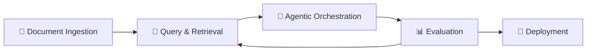

The ingestion workflow prepares documents for retrieval.

The query workflow retrieves evidence and generates answers.

The agent workflow controls retrieval and validation decisions.

The evaluation workflow measures system quality.

The deployment workflow packages the system for reproducible execution.

---

# 2. Document Ingestion Workflow

## 2.1 Overview

A document enters the system through the frontend and is processed into multiple representations.

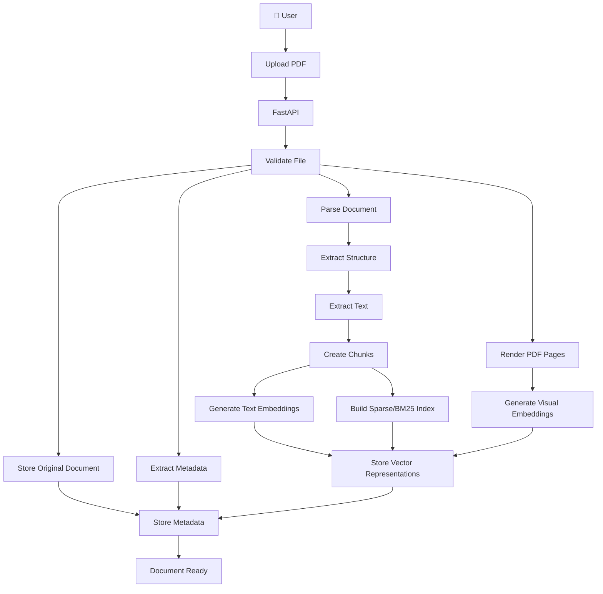

---

# 3. Detailed Ingestion Stages

## Stage 1 — Upload

The user uploads a supported PDF through the frontend.

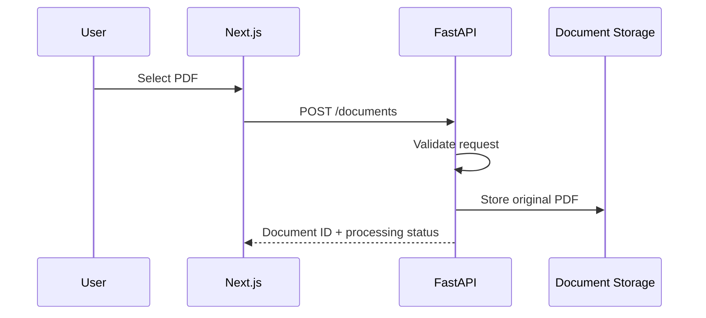

---

## Stage 2 — Validation

The backend validates:

```text
File type
File size
File integrity
Supported document format
```

Invalid files should be rejected before expensive processing begins.

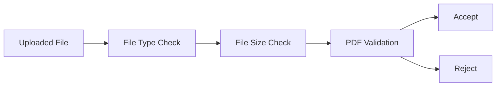

---

## Stage 3 — Parsing

The document is processed using appropriate document-processing tools.

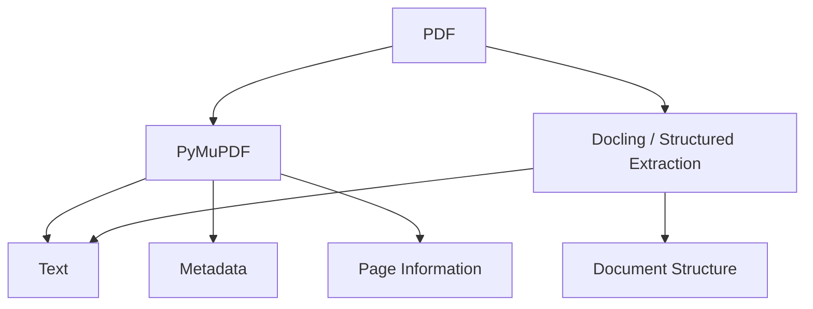

The reference recommends PyMuPDF and Docling for page rendering and structured extraction.

---

# 4. Page Rendering Workflow

Every relevant page can be rendered into an image representation.

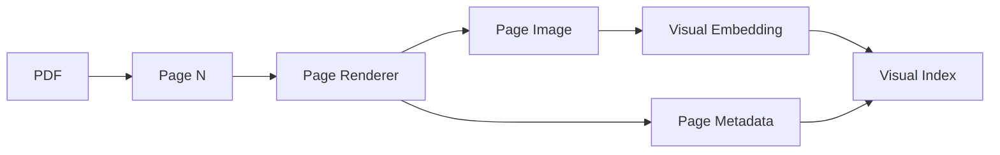

The page number must remain associated with the visual representation.

This enables page-level citations later.

---

# 5. Text Chunking Workflow

Extracted text is converted into retrieval units.

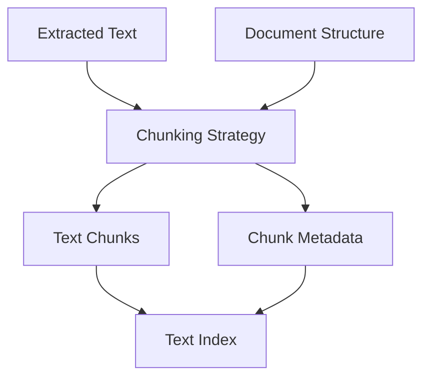

Each chunk should retain:

```text
document_id
page_number
chunk_id
text
section information where available
```

This preserves traceability between retrieval and the original document.

---

# 6. Embedding Workflow

## 6.1 Text Embeddings

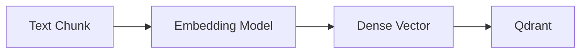

---

## 6.2 Visual Embeddings

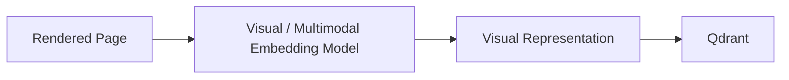

Visual retrieval is introduced after the text baseline has been established.

---

# 7. Query Workflow

## 7.1 End-to-End Query Flow

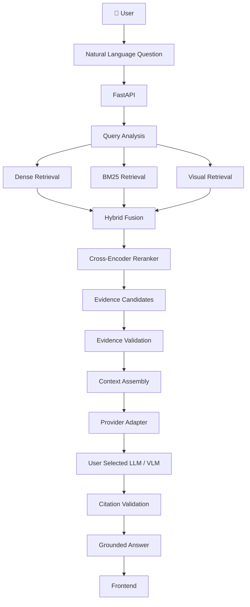

---

# 8. Query Sequence

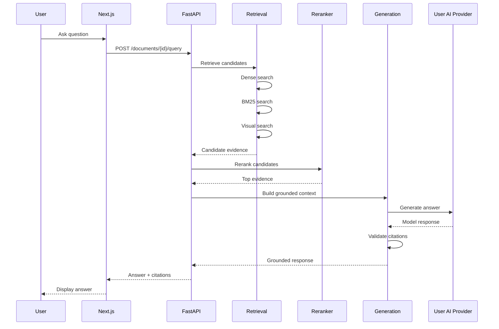

---

# 9. Retrieval Workflow

## 9.1 Parallel Retrieval

The system can query multiple retrieval mechanisms.

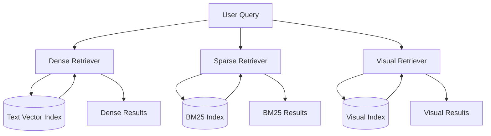

---

# 10. Hybrid Fusion Workflow

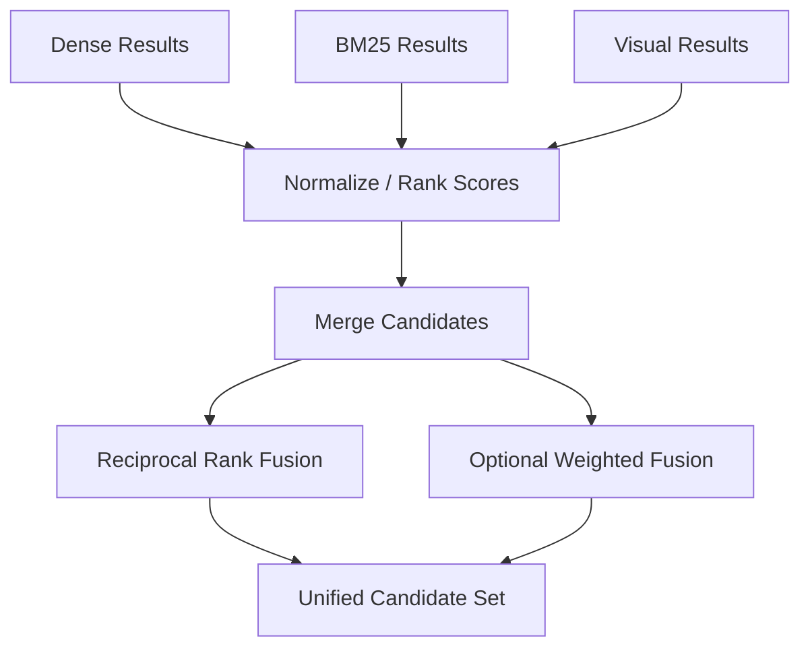

The initial implementation should compare simple fusion strategies experimentally rather than assuming one is universally superior.

---

# 11. Reranking Workflow

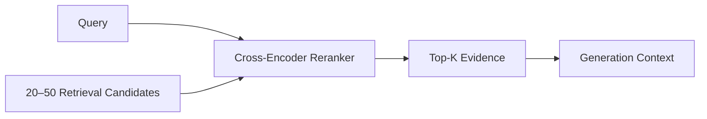

The exact candidate and final `K` values will be determined experimentally.

---

# 12. Agentic Query Workflow

Agents are introduced as a bounded orchestration layer.

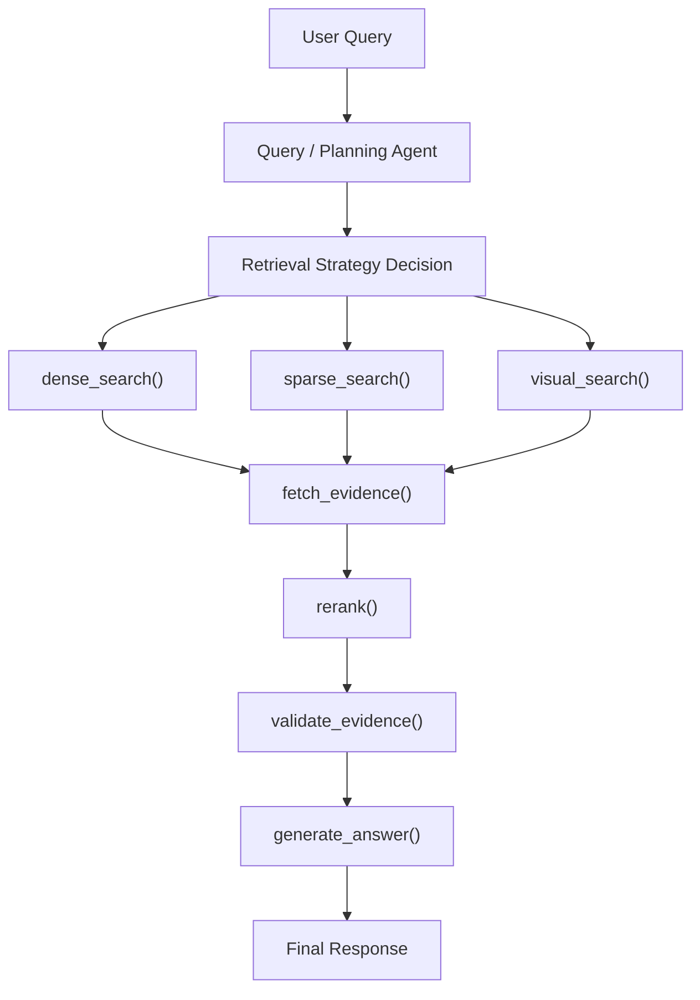

---

# 13. Agent Tool Boundary

The agent should interact through explicit tools.

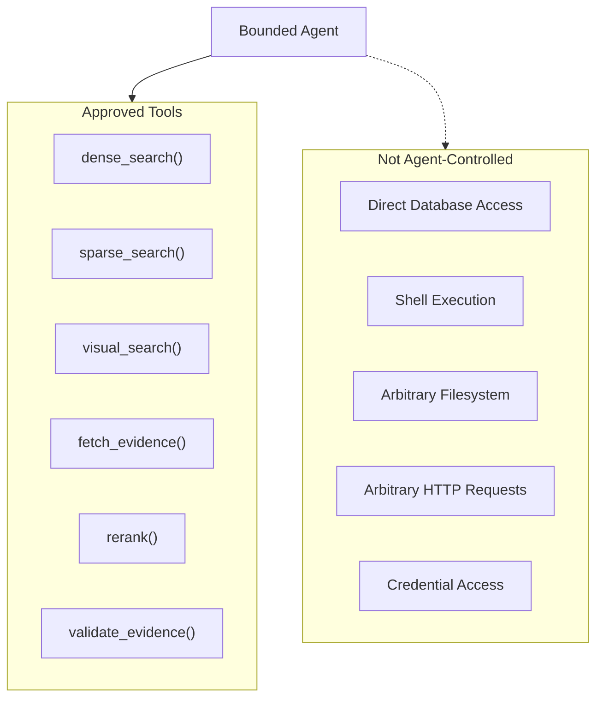

The forbidden boundary is intentional.

Agents should not receive unrestricted infrastructure access.

---

# 14. Grounding Workflow

The generation model receives evidence selected by the retrieval system.

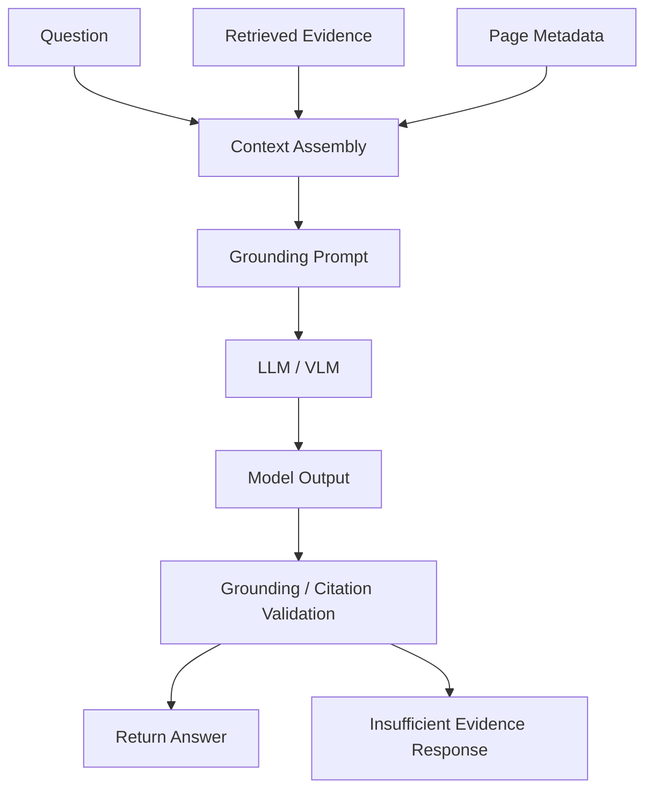

The system should favor an explicit insufficient-evidence response when evidence is inadequate.

---

# 15. Citation Workflow

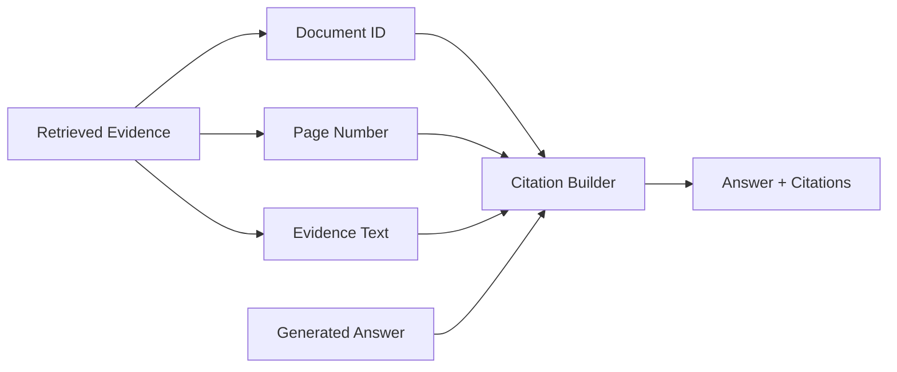

Target citation structure:

```json
{
  "document_id": "doc_123",
  "page": 7,
  "evidence_text": "..."
}
```

---

# 16. BYOK Workflow

The user supplies their own AI provider credentials.

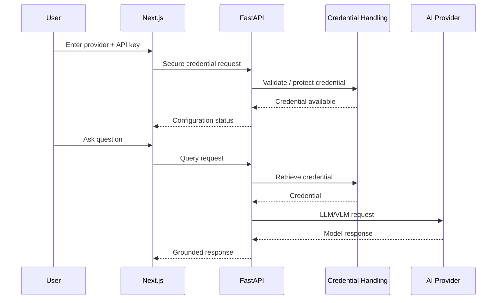

Provider credentials must never be written into ordinary application logs.

---

# 17. Provider Selection Workflow

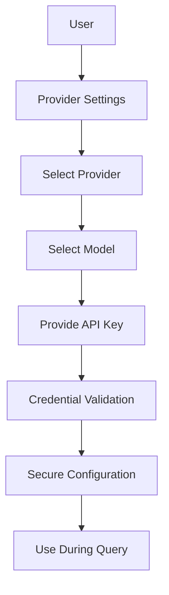

---

# 18. Document Lifecycle

```mermaid
stateDiagram-v2

    [*] --> Uploaded

    Uploaded --> Validating

    Validating --> Rejected: Invalid file

    Validating --> Processing: Valid file

    Processing --> Parsing

    Parsing --> Indexing

    Indexing --> Ready

    Parsing --> Failed: Extraction error

    Indexing --> Failed: Indexing error

    Ready --> Deleted

    Failed --> Processing: Retry

    Deleted --> [*]
```

---

# 19. Query Lifecycle

```mermaid
stateDiagram-v2

    [*] --> Received

    Received --> Analyzing

    Analyzing --> Retrieving

    Retrieving --> Reranking

    Reranking --> Grounding

    Grounding --> Generating

    Generating --> Validating

    Validating --> Completed

    Validating --> InsufficientEvidence

    Retrieving --> RetrievalFailed

    Generating --> ProviderFailed

    RetrievalFailed --> [*]
    ProviderFailed --> [*]
    InsufficientEvidence --> [*]
    Completed --> [*]
```

---

# 20. Failure and Fallback Workflow

DocuLens should fail explicitly rather than silently producing unreliable answers.

```mermaid
flowchart TD

    START["Request"]

    VALIDATE["Validate"]

    PROCESS["Process"]

    RETRIEVE["Retrieve"]

    EVIDENCE["Evidence Sufficient?"]

    GENERATE["Generate"]

    VALIDATE_RESPONSE["Validate Response"]

    SUCCESS["Return Answer"]

    FAIL_FILE["File Error"]

    FAIL_RETRIEVAL["Retrieval Failure"]

    INSUFFICIENT["Insufficient Evidence"]

    FAIL_PROVIDER["Provider Failure"]

    INVALID_RESPONSE["Invalid Model Response"]

    START --> VALIDATE

    VALIDATE --> PROCESS
    VALIDATE --> FAIL_FILE

    PROCESS --> RETRIEVE

    RETRIEVE --> EVIDENCE

    EVIDENCE --> GENERATE
    EVIDENCE --> INSUFFICIENT

    GENERATE --> VALIDATE_RESPONSE

    VALIDATE_RESPONSE --> SUCCESS
    VALIDATE_RESPONSE --> INVALID_RESPONSE

    GENERATE --> FAIL_PROVIDER

    RETRIEVE --> FAIL_RETRIEVAL
```

---

# 21. Evaluation Workflow

Evaluation must be performed independently of the normal application workflow.

```mermaid
flowchart LR

    DATASET["Gold Evaluation Dataset"]

    QUESTIONS["Questions"]

    GROUND_TRUTH["Ground Truth Pages / Answers"]

    SYSTEM["DocuLens Configuration"]

    RETRIEVE["Run Retrieval"]

    GENERATE["Run Generation"]

    METRICS["Calculate Metrics"]

    REPORT["Evaluation Report"]

    COMPARE["Compare Experiments"]

    DATASET --> QUESTIONS
    DATASET --> GROUND_TRUTH

    QUESTIONS --> SYSTEM

    SYSTEM --> RETRIEVE
    RETRIEVE --> GENERATE

    RETRIEVE --> METRICS
    GENERATE --> METRICS
    GROUND_TRUTH --> METRICS

    METRICS --> REPORT
    REPORT --> COMPARE
```

---

# 22. Evaluation Experiment Workflow

The main experiment should compare progressively more capable systems.

```mermaid
flowchart TD

    DATASET["50–100 Evaluation Questions"]

    BASELINE["Text-Only Baseline"]

    DENSE["Dense Retrieval"]

    HYBRID["Dense + BM25"]

    MULTIMODAL["Dense + BM25 + Visual"]

    RERANK["Hybrid + Reranking"]

    METRICS["Evaluate Each Configuration"]

    REPORT["Comparison Report"]

    DATASET --> BASELINE
    DATASET --> DENSE
    DATASET --> HYBRID
    DATASET --> MULTIMODAL
    DATASET --> RERANK

    BASELINE --> METRICS
    DENSE --> METRICS
    HYBRID --> METRICS
    MULTIMODAL --> METRICS
    RERANK --> METRICS

    METRICS --> REPORT
```

Metrics include:

```text
Recall@K
MRR@K
Context Precision
Context Recall
Faithfulness
Answer Relevancy
Latency
Token Usage
```

The reference recommends measuring retriever and generator quality separately.

---

# 23. Failure Analysis Workflow

Evaluation should not stop at aggregate metrics.

```mermaid
flowchart TD

    RESULTS["Evaluation Results"]

    FAILURES["Failed Examples"]

    CLASSIFY["Failure Classification"]

    RETRIEVAL_FAIL["Retrieval Failure"]

    GROUNDING_FAIL["Grounding Failure"]

    GENERATION_FAIL["Generation Failure"]

    PARSING_FAIL["Document Parsing Failure"]

    VISUAL_FAIL["Visual Retrieval Failure"]

    SYSTEM_FAIL["System / Infrastructure Failure"]

    ROOT["Root Cause"]

    IMPROVE["Engineering Change"]

    REEVAL["Re-run Evaluation"]

    RESULTS --> FAILURES
    FAILURES --> CLASSIFY

    CLASSIFY --> RETRIEVAL_FAIL
    CLASSIFY --> GROUNDING_FAIL
    CLASSIFY --> GENERATION_FAIL
    CLASSIFY --> PARSING_FAIL
    CLASSIFY --> VISUAL_FAIL
    CLASSIFY --> SYSTEM_FAIL

    RETRIEVAL_FAIL --> ROOT
    GROUNDING_FAIL --> ROOT
    GENERATION_FAIL --> ROOT
    PARSING_FAIL --> ROOT
    VISUAL_FAIL --> ROOT
    SYSTEM_FAIL --> ROOT

    ROOT --> IMPROVE
    IMPROVE --> REEVAL
```

This enables component-level debugging rather than treating the whole system as one black box.

---

# 24. Observability Workflow

```mermaid
sequenceDiagram

    participant U as User
    participant API as FastAPI
    participant AGENT as Agent
    participant RET as Retrieval
    participant RERANK as Reranker
    participant AI as AI Provider
    participant OBS as Observability

    U->>API: Query

    API->>OBS: Start trace

    API->>AGENT: Query

    AGENT->>OBS: Agent decision

    AGENT->>RET: Retrieve
    RET->>OBS: Retrieval metrics

    RET->>RERANK: Candidates
    RERANK->>OBS: Reranking metrics

    RERANK->>AI: Grounded context
    AI->>OBS: Generation metrics

    AI-->>API: Response

    API->>OBS: Final latency / status

    API-->>U: Answer
```

---

# 25. Observability Data Flow

```mermaid
flowchart TB

    REQUEST["Request"]

    TRACE["Trace"]

    SPANS["Execution Spans"]

    METRICS["Metrics"]

    LOGS["Structured Logs"]

    ERRORS["Errors"]

    DASHBOARD["Observability Dashboard"]

    REQUEST --> TRACE
    TRACE --> SPANS
    TRACE --> METRICS
    TRACE --> LOGS
    TRACE --> ERRORS

    METRICS --> DASHBOARD
    ERRORS --> DASHBOARD
```

Important fields:

```text
request_id
user_id
document_id
query_id
model
provider
retrieval_mode
candidate_count
latency
token_usage
status
failure_type
```

Sensitive values such as raw API keys must never be logged.

---

# 26. Deployment Workflow

```mermaid
flowchart TD

    CODE["Source Code"]

    TEST["Automated Tests"]

    LINT["Lint / Type Checks"]

    BUILD["Build Containers"]

    COMPOSE["Docker Compose"]

    FRONTEND["Frontend Container"]

    BACKEND["Backend Container"]

    POSTGRES["PostgreSQL"]

    QDRANT["Qdrant"]

    USER["User"]

    CODE --> TEST
    TEST --> LINT
    LINT --> BUILD

    BUILD --> COMPOSE

    COMPOSE --> FRONTEND
    COMPOSE --> BACKEND
    COMPOSE --> POSTGRES
    COMPOSE --> QDRANT

    USER --> FRONTEND
    FRONTEND --> BACKEND
```

---

# 27. Local Development Workflow

```mermaid
flowchart LR

    DEVELOPER["Developer"]

    CLONE["Clone Repository"]

    ENV["Configure .env"]

    BUILD["Build Containers"]

    RUN["Start Application"]

    TEST["Run Tests"]

    EVAL["Run Evaluation"]

    COMMIT["Commit Changes"]

    DEVELOPER --> CLONE
    CLONE --> ENV
    ENV --> BUILD
    BUILD --> RUN

    RUN --> TEST
    TEST --> EVAL
    EVAL --> COMMIT
```

---

# 28. Full System Workflow

This diagram represents the complete DocuLens AI lifecycle.

```mermaid
flowchart TB

    USER["👤 User"]

    FRONTEND["Next.js Frontend"]

    API["FastAPI"]

    AUTH["Authentication"]

    DOC["Document Service"]

    PROCESS["Document Processing"]

    INDEX["Indexing"]

    AGENT["Bounded Agent"]

    RETRIEVAL["Hybrid Retrieval"]

    RERANK["Reranking"]

    GROUND["Evidence Grounding"]

    PROVIDER["Provider Adapter"]

    LLM["User LLM / VLM"]

    RESPONSE["Grounded Response"]

    EVIDENCE["Citations + Page Evidence"]

    OBS["Observability"]

    EVAL["Evaluation"]

    USER --> FRONTEND

    FRONTEND --> API

    API --> AUTH

    API --> DOC

    DOC --> PROCESS
    PROCESS --> INDEX

    API --> AGENT

    AGENT --> RETRIEVAL
    RETRIEVAL --> RERANK
    RERANK --> GROUND

    GROUND --> PROVIDER
    PROVIDER --> LLM

    LLM --> RESPONSE
    RESPONSE --> EVIDENCE

    EVIDENCE --> FRONTEND

    API --> OBS
    AGENT --> OBS
    RETRIEVAL --> OBS
    RERANK --> OBS
    PROVIDER --> OBS

    OBS --> EVAL
```

---

# 29. Architecture Evolution

DocuLens AI evolves incrementally.

```mermaid
flowchart LR

    P0["Phase 0<br/>Product Definition"]

    P1["Phase 1<br/>Foundation"]

    P2["Phase 2<br/>Text RAG Baseline"]

    P3["Phase 3<br/>Visual Pipeline"]

    P4["Phase 4<br/>Hybrid Retrieval"]

    P5["Phase 5<br/>Reranking + Grounding"]

    P6["Phase 6<br/>Evaluation"]

    P7["Phase 7<br/>Frontend"]

    P8["Phase 8<br/>Containerization"]

    P9["Phase 9<br/>Observability + Reliability"]

    P10["Advanced<br/>Scaling"]

    P0 --> P1
    P1 --> P2
    P2 --> P3
    P3 --> P4
    P4 --> P5
    P5 --> P6
    P6 --> P7
    P7 --> P8
    P8 --> P9
    P9 --> P10
```

---

# 30. Capability Evolution

```mermaid
flowchart TB

    subgraph BASE["Baseline"]
        B1["PDF"]
        B2["Text Extraction"]
        B3["Chunking"]
        B4["Dense Retrieval"]
        B5["LLM"]
    end

    subgraph MULTI["Multimodal"]
        M1["Page Rendering"]
        M2["Visual Embeddings"]
        M3["Visual Retrieval"]
    end

    subgraph HYBRID["Advanced Retrieval"]
        H1["BM25"]
        H2["Fusion"]
        H3["Reranking"]
    end

    subgraph AGENTIC["Agentic"]
        A1["Query Planning"]
        A2["Tool Selection"]
        A3["Evidence Validation"]
        A4["Bounded Retry"]
    end

    subgraph PRODUCT["Product"]
        P1["Next.js"]
        P2["BYOK"]
        P3["Authentication"]
        P4["Document Library"]
    end

    subgraph PRODUCTION["Production-Oriented"]
        PR1["Observability"]
        PR2["Security"]
        PR3["Reliability"]
        PR4["Docker"]
    end

    BASE --> MULTI
    MULTI --> HYBRID
    HYBRID --> AGENTIC
    AGENTIC --> PRODUCT
    PRODUCT --> PRODUCTION
```

---

# 31. Complexity Growth Strategy

The project should grow according to demonstrated requirements.

```mermaid
flowchart LR

    SIMPLE["Simple Working System"]

    PROBLEM["Identify Limitation"]

    EXPERIMENT["Run Experiment"]

    DECISION["Architecture Decision"]

    IMPLEMENT["Implement Improvement"]

    MEASURE["Measure"]

    DOCUMENT["Document"]

    SIMPLE --> PROBLEM
    PROBLEM --> EXPERIMENT
    EXPERIMENT --> DECISION
    DECISION --> IMPLEMENT
    IMPLEMENT --> MEASURE
    MEASURE --> DOCUMENT

    DOCUMENT --> PROBLEM
```

This loop prevents unnecessary engineering complexity.

---

# 32. Core Engineering Loop

Every major DocuLens AI capability should follow:

```mermaid
flowchart LR

    REQUIREMENT["Requirement"]

    DESIGN["Design"]

    IMPLEMENT["Implementation"]

    TEST["Testing"]

    MEASURE["Measurement"]

    REVIEW["Review"]

    DOCUMENT["Documentation"]

    REQUIREMENT --> DESIGN
    DESIGN --> IMPLEMENT
    IMPLEMENT --> TEST
    TEST --> MEASURE
    MEASURE --> REVIEW
    REVIEW --> DOCUMENT

    DOCUMENT --> REQUIREMENT
```

---

# 33. Final System Mental Model

The simplest way to understand DocuLens AI is:

```mermaid
flowchart LR

    DOCUMENT["📄 Document"]

    UNDERSTAND["🧠 Understand"]

    INDEX["🗂️ Index"]

    RETRIEVE["🔎 Retrieve"]

    RERANK["🎯 Rerank"]

    VALIDATE["✅ Validate Evidence"]

    GENERATE["🤖 Generate"]

    CITE["📚 Cite"]

    DISPLAY["🖥️ Display"]

    DOCUMENT --> UNDERSTAND
    UNDERSTAND --> INDEX
    INDEX --> RETRIEVE
    RETRIEVE --> RERANK
    RERANK --> VALIDATE
    VALIDATE --> GENERATE
    GENERATE --> CITE
    CITE --> DISPLAY
```

The core product promise is therefore:

> **Understand the document → retrieve the right evidence → validate it → generate a grounded answer → show the user where the evidence came from.**

---

# Workflow Design Principles

## 1. Evidence-first

Generation should be downstream of retrieval and evidence validation.

## 2. Traceability

Every important piece of evidence should be traceable to a document and page.

## 3. Multimodal where necessary

Visual processing should solve actual document-understanding problems.

## 4. Bounded agentic behavior

Agents should operate through explicit tools and constraints.

## 5. BYOK

External AI inference uses the user's configured provider credentials.

## 6. Measurable architecture

Every major retrieval improvement should be evaluated against a baseline.

## 7. Explicit failure handling

Failure should be visible rather than silently converted into an unreliable answer.

## 8. Incremental complexity

New infrastructure should be introduced only when a real requirement justifies it.

## 9. Reproducibility

Local development should be reproducible through containerized services.

## 10. Honest engineering

The system should distinguish implemented behavior, measured results, assumptions, and future capabilities.
